```python
import pandas as pd
import numpy as np
import re
import string
import seaborn as sns
import matplotlib.pyplot as plt
from sklearn import linear_model
from sklearn.metrics import mean_squared_error, r2_score
```


```python
strP = 'Z:\One Drive Main Folder\OneDrive - Regis University\Regis\MSDS 696 - PRACTICUM II\W4\\'
```


```python
gms = pd.read_csv(strP + 'SteamData_W4_Cleaned.csv',encoding = "ISO-8859-1")
```


```python
gms.head()
```


<div>
<style scoped>
    .dataframe tbody tr th:only-of-type {
        vertical-align: middle;
    }

    .dataframe tbody tr th {
        vertical-align: top;
    }

    .dataframe thead th {
        text-align: right;
    }
</style>
<table border="1" class="dataframe">
  <thead>
    <tr style="text-align: right;">
      <th></th>
      <th>Game_ID</th>
      <th>Site</th>
      <th>Description</th>
      <th>PCT_Pos_Rev</th>
      <th>Total_Rev</th>
      <th>Developer</th>
      <th>Developer_Count</th>
      <th>Developer_Primary</th>
      <th>Publisher</th>
      <th>Publisher_Count</th>
      <th>...</th>
      <th>Simulation</th>
      <th>Sports</th>
      <th>Strategy</th>
      <th>Franchise</th>
      <th>Franchise_YN</th>
      <th>Franchise_Count</th>
      <th>Metacritic</th>
      <th>Price</th>
      <th>Purchase_Options</th>
      <th>FinalReleaseDt</th>
    </tr>
  </thead>
  <tbody>
    <tr>
      <th>0</th>
      <td>782330</td>
      <td>https://store.steampowered.com/app/782330/DOOM...</td>
      <td>Hell’s armies have invaded Earth. Become the S...</td>
      <td>85.0</td>
      <td>59927.0</td>
      <td>id Software</td>
      <td>1</td>
      <td>id Software</td>
      <td>Bethesda Softworks</td>
      <td>1</td>
      <td>...</td>
      <td>N</td>
      <td>N</td>
      <td>N</td>
      <td>DOOM</td>
      <td>Y</td>
      <td>9.0</td>
      <td>88.0</td>
      <td>59.99</td>
      <td>3</td>
      <td>3/19/2020</td>
    </tr>
    <tr>
      <th>1</th>
      <td>570</td>
      <td>https://store.steampowered.com/app/570/Dota_2/...</td>
      <td>Every day, millions of players worldwide enter...</td>
      <td>84.0</td>
      <td>1333619.0</td>
      <td>Valve</td>
      <td>1</td>
      <td>Valve</td>
      <td>Valve</td>
      <td>1</td>
      <td>...</td>
      <td>N</td>
      <td>N</td>
      <td>Y</td>
      <td>NaN</td>
      <td>N</td>
      <td>NaN</td>
      <td>90.0</td>
      <td>0.00</td>
      <td>2</td>
      <td>7/9/2013</td>
    </tr>
    <tr>
      <th>2</th>
      <td>976730</td>
      <td>https://store.steampowered.com/app/976730/Halo...</td>
      <td>The Master Chief’s iconic journey includes six...</td>
      <td>91.0</td>
      <td>86340.0</td>
      <td>343 Industries, Splash Damage, Ruffian Games, ...</td>
      <td>5</td>
      <td>343 Industries</td>
      <td>Xbox Game Studios</td>
      <td>1</td>
      <td>...</td>
      <td>N</td>
      <td>N</td>
      <td>N</td>
      <td>Halo</td>
      <td>Y</td>
      <td>1.0</td>
      <td>NaN</td>
      <td>39.99</td>
      <td>2</td>
      <td>12/3/2019</td>
    </tr>
    <tr>
      <th>3</th>
      <td>1174180</td>
      <td>https://store.steampowered.com/app/1174180/Red...</td>
      <td>Winner of over 175 Game of the Year Awards and...</td>
      <td>76.0</td>
      <td>83987.0</td>
      <td>Rockstar Games</td>
      <td>1</td>
      <td>Rockstar Games</td>
      <td>Rockstar Games</td>
      <td>1</td>
      <td>...</td>
      <td>N</td>
      <td>N</td>
      <td>N</td>
      <td>Red Dead Redemption</td>
      <td>Y</td>
      <td>1.0</td>
      <td>93.0</td>
      <td>59.99</td>
      <td>3</td>
      <td>12/5/2019</td>
    </tr>
    <tr>
      <th>4</th>
      <td>397540</td>
      <td>https://store.steampowered.com/app/397540/Bord...</td>
      <td>The original shooter-looter returns, packing b...</td>
      <td>82.0</td>
      <td>33254.0</td>
      <td>Gearbox Software</td>
      <td>1</td>
      <td>Gearbox Software</td>
      <td>2K</td>
      <td>1</td>
      <td>...</td>
      <td>N</td>
      <td>N</td>
      <td>N</td>
      <td>Borderlands</td>
      <td>Y</td>
      <td>4.0</td>
      <td>81.0</td>
      <td>59.99</td>
      <td>4</td>
      <td>3/13/2020</td>
    </tr>
  </tbody>
</table>
<p>5 rows × 51 columns</p>
</div>


```python
gms.info()
```

    <class 'pandas.core.frame.DataFrame'>
    RangeIndex: 15726 entries, 0 to 15725
    Data columns (total 51 columns):
     #   Column                 Non-Null Count  Dtype  
    ---  ------                 --------------  -----  
     0   Game_ID                15726 non-null  int64  
     1   Site                   15726 non-null  object 
     2   Description            15724 non-null  object 
     3   PCT_Pos_Rev            4181 non-null   float64
     4   Total_Rev              4181 non-null   float64
     5   Developer              15719 non-null  object 
     6   Developer_Count        15726 non-null  int64  
     7   Developer_Primary      15726 non-null  object 
     8   Publisher              15714 non-null  object 
     9   Publisher_Count        15726 non-null  int64  
     10  Publisher_Primary      15721 non-null  object 
     11  ESRB                   3391 non-null   object 
     12  ESRBWhy                2510 non-null   object 
     13  Violence               15726 non-null  object 
     14  Blood                  15726 non-null  object 
     15  Language               15726 non-null  object 
     16  Mild                   15726 non-null  object 
     17  Alcohol                15726 non-null  object 
     18  Suggestive             15726 non-null  object 
     19  Sexual                 15726 non-null  object 
     20  Strong                 15726 non-null  object 
     21  Fantasy                15726 non-null  object 
     22  Gore                   15726 non-null  object 
     23  Drug                   15726 non-null  object 
     24  Nudity                 15726 non-null  object 
     25  Tobacco                15726 non-null  object 
     26  Intense                15726 non-null  object 
     27  Partial                15726 non-null  object 
     28  Humor                  15726 non-null  object 
     29  Crude                  15726 non-null  object 
     30  Title                  15726 non-null  object 
     31  Genre                  15726 non-null  object 
     32  Action                 15726 non-null  object 
     33  Adventure              15726 non-null  object 
     34  Casual                 15726 non-null  object 
     35  Early Access           15726 non-null  object 
     36  Free to Play           15726 non-null  object 
     37  Indie                  15726 non-null  object 
     38  Massively Multiplayer  15726 non-null  object 
     39  Racing                 15726 non-null  object 
     40  RPG                    15726 non-null  object 
     41  Simulation             15726 non-null  object 
     42  Sports                 15726 non-null  object 
     43  Strategy               15726 non-null  object 
     44  Franchise              3803 non-null   object 
     45  Franchise_YN           15726 non-null  object 
     46  Franchise_Count        3803 non-null   float64
     47  Metacritic             1377 non-null   float64
     48  Price                  15726 non-null  float64
     49  Purchase_Options       15726 non-null  int64  
     50  FinalReleaseDt         15726 non-null  object 
    dtypes: float64(5), int64(4), object(42)
    memory usage: 6.1+ MB
    


```python
unique_counts = pd.DataFrame.from_records([(col, gms[col].nunique()) for col in gms.columns],
                          columns=['Column_Name', 'Num_Unique']).sort_values(by=['Num_Unique'])
unique_counts
```


<div>
<style scoped>
    .dataframe tbody tr th:only-of-type {
        vertical-align: middle;
    }

    .dataframe tbody tr th {
        vertical-align: top;
    }

    .dataframe thead th {
        text-align: right;
    }
</style>
<table border="1" class="dataframe">
  <thead>
    <tr style="text-align: right;">
      <th></th>
      <th>Column_Name</th>
      <th>Num_Unique</th>
    </tr>
  </thead>
  <tbody>
    <tr>
      <th>25</th>
      <td>Tobacco</td>
      <td>2</td>
    </tr>
    <tr>
      <th>22</th>
      <td>Gore</td>
      <td>2</td>
    </tr>
    <tr>
      <th>23</th>
      <td>Drug</td>
      <td>2</td>
    </tr>
    <tr>
      <th>24</th>
      <td>Nudity</td>
      <td>2</td>
    </tr>
    <tr>
      <th>26</th>
      <td>Intense</td>
      <td>2</td>
    </tr>
    <tr>
      <th>27</th>
      <td>Partial</td>
      <td>2</td>
    </tr>
    <tr>
      <th>28</th>
      <td>Humor</td>
      <td>2</td>
    </tr>
    <tr>
      <th>29</th>
      <td>Crude</td>
      <td>2</td>
    </tr>
    <tr>
      <th>21</th>
      <td>Fantasy</td>
      <td>2</td>
    </tr>
    <tr>
      <th>42</th>
      <td>Sports</td>
      <td>2</td>
    </tr>
    <tr>
      <th>33</th>
      <td>Adventure</td>
      <td>2</td>
    </tr>
    <tr>
      <th>34</th>
      <td>Casual</td>
      <td>2</td>
    </tr>
    <tr>
      <th>35</th>
      <td>Early Access</td>
      <td>2</td>
    </tr>
    <tr>
      <th>36</th>
      <td>Free to Play</td>
      <td>2</td>
    </tr>
    <tr>
      <th>37</th>
      <td>Indie</td>
      <td>2</td>
    </tr>
    <tr>
      <th>38</th>
      <td>Massively Multiplayer</td>
      <td>2</td>
    </tr>
    <tr>
      <th>39</th>
      <td>Racing</td>
      <td>2</td>
    </tr>
    <tr>
      <th>32</th>
      <td>Action</td>
      <td>2</td>
    </tr>
    <tr>
      <th>40</th>
      <td>RPG</td>
      <td>2</td>
    </tr>
    <tr>
      <th>20</th>
      <td>Strong</td>
      <td>2</td>
    </tr>
    <tr>
      <th>18</th>
      <td>Suggestive</td>
      <td>2</td>
    </tr>
    <tr>
      <th>45</th>
      <td>Franchise_YN</td>
      <td>2</td>
    </tr>
    <tr>
      <th>19</th>
      <td>Sexual</td>
      <td>2</td>
    </tr>
    <tr>
      <th>43</th>
      <td>Strategy</td>
      <td>2</td>
    </tr>
    <tr>
      <th>13</th>
      <td>Violence</td>
      <td>2</td>
    </tr>
    <tr>
      <th>41</th>
      <td>Simulation</td>
      <td>2</td>
    </tr>
    <tr>
      <th>14</th>
      <td>Blood</td>
      <td>2</td>
    </tr>
    <tr>
      <th>15</th>
      <td>Language</td>
      <td>2</td>
    </tr>
    <tr>
      <th>16</th>
      <td>Mild</td>
      <td>2</td>
    </tr>
    <tr>
      <th>17</th>
      <td>Alcohol</td>
      <td>2</td>
    </tr>
    <tr>
      <th>9</th>
      <td>Publisher_Count</td>
      <td>6</td>
    </tr>
    <tr>
      <th>11</th>
      <td>ESRB</td>
      <td>7</td>
    </tr>
    <tr>
      <th>49</th>
      <td>Purchase_Options</td>
      <td>9</td>
    </tr>
    <tr>
      <th>6</th>
      <td>Developer_Count</td>
      <td>11</td>
    </tr>
    <tr>
      <th>47</th>
      <td>Metacritic</td>
      <td>22</td>
    </tr>
    <tr>
      <th>46</th>
      <td>Franchise_Count</td>
      <td>31</td>
    </tr>
    <tr>
      <th>3</th>
      <td>PCT_Pos_Rev</td>
      <td>73</td>
    </tr>
    <tr>
      <th>48</th>
      <td>Price</td>
      <td>134</td>
    </tr>
    <tr>
      <th>31</th>
      <td>Genre</td>
      <td>716</td>
    </tr>
    <tr>
      <th>12</th>
      <td>ESRBWhy</td>
      <td>1170</td>
    </tr>
    <tr>
      <th>44</th>
      <td>Franchise</td>
      <td>1403</td>
    </tr>
    <tr>
      <th>4</th>
      <td>Total_Rev</td>
      <td>2847</td>
    </tr>
    <tr>
      <th>50</th>
      <td>FinalReleaseDt</td>
      <td>3482</td>
    </tr>
    <tr>
      <th>10</th>
      <td>Publisher_Primary</td>
      <td>6700</td>
    </tr>
    <tr>
      <th>8</th>
      <td>Publisher</td>
      <td>6923</td>
    </tr>
    <tr>
      <th>7</th>
      <td>Developer_Primary</td>
      <td>8798</td>
    </tr>
    <tr>
      <th>5</th>
      <td>Developer</td>
      <td>9237</td>
    </tr>
    <tr>
      <th>2</th>
      <td>Description</td>
      <td>15646</td>
    </tr>
    <tr>
      <th>30</th>
      <td>Title</td>
      <td>15707</td>
    </tr>
    <tr>
      <th>1</th>
      <td>Site</td>
      <td>15726</td>
    </tr>
    <tr>
      <th>0</th>
      <td>Game_ID</td>
      <td>15726</td>
    </tr>
  </tbody>
</table>
</div>


```python
gms2 = gms.copy()
gms2 = gms2.drop(['Game_ID',
                  'Site',  
                  'Description', 
                  'Developer', 
                  'Publisher', 
                  'Metacritic'], axis=1)
```


```python
gms2.head(2)
```


<div>
<style scoped>
    .dataframe tbody tr th:only-of-type {
        vertical-align: middle;
    }

    .dataframe tbody tr th {
        vertical-align: top;
    }

    .dataframe thead th {
        text-align: right;
    }
</style>
<table border="1" class="dataframe">
  <thead>
    <tr style="text-align: right;">
      <th></th>
      <th>PCT_Pos_Rev</th>
      <th>Total_Rev</th>
      <th>Developer_Count</th>
      <th>Developer_Primary</th>
      <th>Publisher_Count</th>
      <th>Publisher_Primary</th>
      <th>ESRB</th>
      <th>ESRBWhy</th>
      <th>Violence</th>
      <th>Blood</th>
      <th>...</th>
      <th>RPG</th>
      <th>Simulation</th>
      <th>Sports</th>
      <th>Strategy</th>
      <th>Franchise</th>
      <th>Franchise_YN</th>
      <th>Franchise_Count</th>
      <th>Price</th>
      <th>Purchase_Options</th>
      <th>FinalReleaseDt</th>
    </tr>
  </thead>
  <tbody>
    <tr>
      <th>0</th>
      <td>85.0</td>
      <td>59927.0</td>
      <td>1</td>
      <td>id Software</td>
      <td>1</td>
      <td>Bethesda Softworks</td>
      <td>m</td>
      <td>Blood and Gore| Intense Violence</td>
      <td>Y</td>
      <td>Y</td>
      <td>...</td>
      <td>N</td>
      <td>N</td>
      <td>N</td>
      <td>N</td>
      <td>DOOM</td>
      <td>Y</td>
      <td>9.0</td>
      <td>59.99</td>
      <td>3</td>
      <td>3/19/2020</td>
    </tr>
    <tr>
      <th>1</th>
      <td>84.0</td>
      <td>1333619.0</td>
      <td>1</td>
      <td>Valve</td>
      <td>1</td>
      <td>Valve</td>
      <td>NaN</td>
      <td>NaN</td>
      <td>N</td>
      <td>N</td>
      <td>...</td>
      <td>N</td>
      <td>N</td>
      <td>N</td>
      <td>Y</td>
      <td>NaN</td>
      <td>N</td>
      <td>NaN</td>
      <td>0.00</td>
      <td>2</td>
      <td>7/9/2013</td>
    </tr>
  </tbody>
</table>
<p>2 rows × 45 columns</p>
</div>


```python
gms2.mean()
```


    PCT_Pos_Rev           83.450849
    Total_Rev           9017.671610
    Developer_Count        1.099453
    Publisher_Count        1.056531
    Franchise_Count       10.155667
    Price                 10.993151
    Purchase_Options       1.395523
    dtype: float64


## Separate the Data for EDA


```python
# Create separate data sets for different approaches
# esrb = ESRB focus ONLY
# genre = Genre focus ONLY
# devpub = developer and publisher focus
# revs = review focus (remove entries without data in PCT_Pos_Rev)
esrb = gms2.copy()
esrb = esrb[esrb['ESRBWhy'].notna()]

genre = gms2.copy()

devpub = gms2.copy()
devpub = devpub[devpub['Publisher_Primary'].notna()]
```

## ESRB Why EDA


```python
esrb.mean()
```


    PCT_Pos_Rev            81.897138
    Total_Rev           12680.105182
    Developer_Count         1.159363
    Publisher_Count         1.099203
    Franchise_Count        10.117225
    Price                  17.384287
    Purchase_Options        1.707171
    dtype: float64


Did you notice the unusually high Franchise_Count average from earlier, and that it still is present? This means that we're, probably, only seeing games that have lots of eyes on them, normally. This could mean that ESRB is obtained by games where the popularity hits a specific point, and the developer/publisher feels that it is necessary to get it?

In a quick Google search, there is no actual enforcement that a game HAS to get ratings on their game, to be released. ESRB is simply a "professional" and respected means of obtaining a rating for content. The Franchise count of 10+, has a few stipulations in its calculations, that make this more acceptable.
    1. It's NOT counting values of Null
    2. The closer a franchise reaches to having 10+ titles, the more likely it would be, that they would want to obtain ESRB ratings.

Chances are, if you're a gamer, you've heard of these titles before. I would wager that you don't see Indie (Independent Developer) games, very often, on this list, because they do not have a franchise yet. That said, let's find out if that's true or not!


```python
esrb['Indie'].value_counts().plot.pie()
```


    <AxesSubplot:ylabel='Indie'>


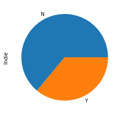


So, not a large amount, as expected. However, larger than I would have guessed! Let's dive into that some more...


```python
# Let's take a look at the indie games that DO have an ESRB rating. See if we recognize any of them.
ind = esrb.copy()
ind = ind.loc[ind['Indie'] == 'Y']
ind['Title'].head(n=15)
```


    31        ARK: Survival Evolved
    58               Stardew Valley
    72               Risk of Rain 2
    73               Rocket League®
    81     The Jackbox Party Pack 6
    91                  Gang Beasts
    92                Hollow Knight
    97                   Subnautica
    107      Golf With Your Friends
    109                We Happy Few
    117    The Jackbox Party Pack 3
    123                     Cuphead
    139    The Jackbox Party Pack 4
    144              Slay the Spire
    146                   Wreckfest
    Name: Title, dtype: object


Okay, this is beginning to make more sense now. Apparently, the Genre tag of Indie, is very much open for interpretation! I know Rocket League is made by Psyonix. I would struggle to describe Psyonix as an indie developer. I suppose there needs to be a definition of what makes a developer an "Indie" developer, at this point.

Alright, in Googling the topic, I found that there is not an "official" definition. However, the main focus is on monetary support by the developers, from a publisher of some sort. This would make sense for all of these games, really. They started out with a handfull of developers, and made a popular game. That can be said of all of these titles. Psyonix is now large, but their first game came out on the Playstation 3, several years ago. The predecessor to Rocket League (which was identical in concept, but different in execution) was titled... Ready for this?... Supersonic Acrobatic Rocket-Powered Battle-Cars.

Despite the horrible older game's title, they revamped it, made it for a new era, and delivered the simpler-titled sequel, Rocket League, sometime in 2015. The game was a massive success, earning Psyonix a buyout from Epic Games, the studio that owns the popular game Fortnite. I'm guessing they haven't removed the genre tag, since Psyonix was "picked up" from Epic games, and was released as an Indie title in the monetary focused definition.

Alright, that's enough deep diving into this area. Moving on...

Let's take a look at the average positive review percentage, based off of the ESRB ratings.


```python
esrb.groupby('ESRB', as_index=False)['PCT_Pos_Rev'].mean()
```


<div>
<style scoped>
    .dataframe tbody tr th:only-of-type {
        vertical-align: middle;
    }

    .dataframe tbody tr th {
        vertical-align: top;
    }

    .dataframe thead th {
        text-align: right;
    }
</style>
<table border="1" class="dataframe">
  <thead>
    <tr style="text-align: right;">
      <th></th>
      <th>ESRB</th>
      <th>PCT_Pos_Rev</th>
    </tr>
  </thead>
  <tbody>
    <tr>
      <th>0</th>
      <td>ao</td>
      <td>78.000000</td>
    </tr>
    <tr>
      <th>1</th>
      <td>e</td>
      <td>83.922222</td>
    </tr>
    <tr>
      <th>2</th>
      <td>e10</td>
      <td>83.726852</td>
    </tr>
    <tr>
      <th>3</th>
      <td>ec</td>
      <td>NaN</td>
    </tr>
    <tr>
      <th>4</th>
      <td>m</td>
      <td>80.813953</td>
    </tr>
    <tr>
      <th>5</th>
      <td>rp</td>
      <td>65.000000</td>
    </tr>
    <tr>
      <th>6</th>
      <td>t</td>
      <td>81.810547</td>
    </tr>
  </tbody>
</table>
</div>


Nothing shocking here. The fluctuation here is minimal at best. Looks like Early Childhood (EC) ratings are all null in that column. This, kind of, makes sense. Steam is on PC. PC's, and the games you can play on them, are usually not available to kids who are that early into their development. Rating Pending (RP) seems a little odd though. I'm gonna guess that there are very few titles in any of the categories that average out to an exact integer, making the Adults Only (AO) value just as suspicious. Let's take a look.


```python
adon = esrb.copy()
adon = adon.loc[adon['ESRB'] == 'ao']
adon[['ESRB','Title','PCT_Pos_Rev','Total_Rev']]
```


<div>
<style scoped>
    .dataframe tbody tr th:only-of-type {
        vertical-align: middle;
    }

    .dataframe tbody tr th {
        vertical-align: top;
    }

    .dataframe thead th {
        text-align: right;
    }
</style>
<table border="1" class="dataframe">
  <thead>
    <tr style="text-align: right;">
      <th></th>
      <th>ESRB</th>
      <th>Title</th>
      <th>PCT_Pos_Rev</th>
      <th>Total_Rev</th>
    </tr>
  </thead>
  <tbody>
    <tr>
      <th>2631</th>
      <td>ao</td>
      <td>Hatred</td>
      <td>78.0</td>
      <td>7574.0</td>
    </tr>
    <tr>
      <th>8179</th>
      <td>ao</td>
      <td>Perfect Crime</td>
      <td>NaN</td>
      <td>NaN</td>
    </tr>
  </tbody>
</table>
</div>


```python
rpend = esrb.copy()
rpend = rpend.loc[rpend['ESRB'] == 'rp']
rpend[['ESRB','Title','PCT_Pos_Rev','Total_Rev']]
```


<div>
<style scoped>
    .dataframe tbody tr th:only-of-type {
        vertical-align: middle;
    }

    .dataframe tbody tr th {
        vertical-align: top;
    }

    .dataframe thead th {
        text-align: right;
    }
</style>
<table border="1" class="dataframe">
  <thead>
    <tr style="text-align: right;">
      <th></th>
      <th>ESRB</th>
      <th>Title</th>
      <th>PCT_Pos_Rev</th>
      <th>Total_Rev</th>
    </tr>
  </thead>
  <tbody>
    <tr>
      <th>3106</th>
      <td>rp</td>
      <td>Comanche</td>
      <td>NaN</td>
      <td>NaN</td>
    </tr>
    <tr>
      <th>4047</th>
      <td>rp</td>
      <td>A Mortician's Tale</td>
      <td>65.0</td>
      <td>404.0</td>
    </tr>
    <tr>
      <th>6435</th>
      <td>rp</td>
      <td>EDEN STAR</td>
      <td>NaN</td>
      <td>NaN</td>
    </tr>
    <tr>
      <th>11193</th>
      <td>rp</td>
      <td>Oniken: Unstoppable Edition</td>
      <td>NaN</td>
      <td>NaN</td>
    </tr>
    <tr>
      <th>13274</th>
      <td>rp</td>
      <td>SKIPCHASER</td>
      <td>NaN</td>
      <td>NaN</td>
    </tr>
  </tbody>
</table>
</div>


Exactly what I suspected. A bunch of games I've never heard of, and only 1 actual Review score for each. Lastly, let's take a look at the ESRBWhy categories, and see what common phrases pop up in the various ratings being given.


```python
# let's first see how many titles are in each rating category.
esrb['ESRB'].value_counts()
```


    t      1005
    m       701
    e10     476
    e       320
    rp        5
    ao        2
    ec        1
    Name: ESRB, dtype: int64


```python
# Breakout of the top 4 should be the focus, so let's break out the ESRB data by those 4 ratings specifically.
options = ['t','m','e10','e'] 
esrb4 = esrb.copy()
esrb4 = esrb4.loc[esrb4['ESRB'].isin(options)]
```


```python
# Now let's Remove all unnecessary columns
esrb5 = esrb4.iloc[: , 6:26].copy()
esrb5.drop('ESRBWhy',axis=1,inplace=True)
esrb5.head(2)
```


<div>
<style scoped>
    .dataframe tbody tr th:only-of-type {
        vertical-align: middle;
    }

    .dataframe tbody tr th {
        vertical-align: top;
    }

    .dataframe thead th {
        text-align: right;
    }
</style>
<table border="1" class="dataframe">
  <thead>
    <tr style="text-align: right;">
      <th></th>
      <th>ESRB</th>
      <th>Violence</th>
      <th>Blood</th>
      <th>Language</th>
      <th>Mild</th>
      <th>Alcohol</th>
      <th>Suggestive</th>
      <th>Sexual</th>
      <th>Strong</th>
      <th>Fantasy</th>
      <th>Gore</th>
      <th>Drug</th>
      <th>Nudity</th>
      <th>Tobacco</th>
      <th>Intense</th>
      <th>Partial</th>
      <th>Humor</th>
      <th>Crude</th>
      <th>Title</th>
    </tr>
  </thead>
  <tbody>
    <tr>
      <th>0</th>
      <td>m</td>
      <td>Y</td>
      <td>Y</td>
      <td>N</td>
      <td>N</td>
      <td>N</td>
      <td>N</td>
      <td>N</td>
      <td>N</td>
      <td>N</td>
      <td>Y</td>
      <td>N</td>
      <td>N</td>
      <td>N</td>
      <td>Y</td>
      <td>N</td>
      <td>N</td>
      <td>N</td>
      <td>DOOM Eternal</td>
    </tr>
    <tr>
      <th>2</th>
      <td>m</td>
      <td>Y</td>
      <td>Y</td>
      <td>Y</td>
      <td>N</td>
      <td>N</td>
      <td>N</td>
      <td>N</td>
      <td>N</td>
      <td>N</td>
      <td>Y</td>
      <td>N</td>
      <td>N</td>
      <td>N</td>
      <td>N</td>
      <td>N</td>
      <td>N</td>
      <td>N</td>
      <td>Halo: The Master Chief Collection</td>
    </tr>
  </tbody>
</table>
</div>


```python
# Next, lets convert these values into binary 1's and 0's for easier aggregation later.
for col in esrb5.iloc[: , 1:18]:
    esrb5[col] = esrb5[col].map({'Y': 1, 'N': 0})
```


```python
# Verify that the conversion worked
esrb5.info()
```

    <class 'pandas.core.frame.DataFrame'>
    Int64Index: 2502 entries, 0 to 15572
    Data columns (total 19 columns):
     #   Column      Non-Null Count  Dtype 
    ---  ------      --------------  ----- 
     0   ESRB        2502 non-null   object
     1   Violence    2502 non-null   int64 
     2   Blood       2502 non-null   int64 
     3   Language    2502 non-null   int64 
     4   Mild        2502 non-null   int64 
     5   Alcohol     2502 non-null   int64 
     6   Suggestive  2502 non-null   int64 
     7   Sexual      2502 non-null   int64 
     8   Strong      2502 non-null   int64 
     9   Fantasy     2502 non-null   int64 
     10  Gore        2502 non-null   int64 
     11  Drug        2502 non-null   int64 
     12  Nudity      2502 non-null   int64 
     13  Tobacco     2502 non-null   int64 
     14  Intense     2502 non-null   int64 
     15  Partial     2502 non-null   int64 
     16  Humor       2502 non-null   int64 
     17  Crude       2502 non-null   int64 
     18  Title       2502 non-null   object
    dtypes: int64(17), object(2)
    memory usage: 390.9+ KB
    


```python
esrb5.groupby('ESRB').mean().round(4)*100
```


<div>
<style scoped>
    .dataframe tbody tr th:only-of-type {
        vertical-align: middle;
    }

    .dataframe tbody tr th {
        vertical-align: top;
    }

    .dataframe thead th {
        text-align: right;
    }
</style>
<table border="1" class="dataframe">
  <thead>
    <tr style="text-align: right;">
      <th></th>
      <th>Violence</th>
      <th>Blood</th>
      <th>Language</th>
      <th>Mild</th>
      <th>Alcohol</th>
      <th>Suggestive</th>
      <th>Sexual</th>
      <th>Strong</th>
      <th>Fantasy</th>
      <th>Gore</th>
      <th>Drug</th>
      <th>Nudity</th>
      <th>Tobacco</th>
      <th>Intense</th>
      <th>Partial</th>
      <th>Humor</th>
      <th>Crude</th>
    </tr>
    <tr>
      <th>ESRB</th>
      <th></th>
      <th></th>
      <th></th>
      <th></th>
      <th></th>
      <th></th>
      <th></th>
      <th></th>
      <th></th>
      <th></th>
      <th></th>
      <th></th>
      <th></th>
      <th></th>
      <th></th>
      <th></th>
      <th></th>
    </tr>
  </thead>
  <tbody>
    <tr>
      <th>e</th>
      <td>72.19</td>
      <td>3.44</td>
      <td>6.56</td>
      <td>63.44</td>
      <td>10.62</td>
      <td>1.25</td>
      <td>0.00</td>
      <td>0.00</td>
      <td>35.62</td>
      <td>0.00</td>
      <td>0.00</td>
      <td>0.00</td>
      <td>5.31</td>
      <td>0.00</td>
      <td>0.00</td>
      <td>2.19</td>
      <td>2.19</td>
    </tr>
    <tr>
      <th>e10</th>
      <td>91.81</td>
      <td>15.76</td>
      <td>24.79</td>
      <td>45.38</td>
      <td>17.44</td>
      <td>11.34</td>
      <td>0.00</td>
      <td>0.00</td>
      <td>63.24</td>
      <td>0.21</td>
      <td>0.84</td>
      <td>0.00</td>
      <td>9.03</td>
      <td>0.00</td>
      <td>0.00</td>
      <td>7.56</td>
      <td>7.77</td>
    </tr>
    <tr>
      <th>m</th>
      <td>94.44</td>
      <td>92.72</td>
      <td>69.90</td>
      <td>3.00</td>
      <td>10.56</td>
      <td>9.99</td>
      <td>32.24</td>
      <td>57.06</td>
      <td>1.00</td>
      <td>50.64</td>
      <td>21.11</td>
      <td>18.69</td>
      <td>2.14</td>
      <td>38.09</td>
      <td>12.55</td>
      <td>3.42</td>
      <td>2.00</td>
    </tr>
    <tr>
      <th>t</th>
      <td>91.54</td>
      <td>55.52</td>
      <td>43.28</td>
      <td>38.71</td>
      <td>20.10</td>
      <td>27.26</td>
      <td>7.16</td>
      <td>0.20</td>
      <td>18.91</td>
      <td>5.57</td>
      <td>6.67</td>
      <td>7.56</td>
      <td>10.35</td>
      <td>0.00</td>
      <td>7.96</td>
      <td>7.86</td>
      <td>7.56</td>
    </tr>
  </tbody>
</table>
</div>


The data above, is the numbers above are averages for each of the times that a Yes appears, for the ESRBWhy column's breakout values. Not a surprise, that most games have violence of some sort, and the rest of the columns make sense as to why they might have higher or lower average counts that determine the ESRB rating. I think the more interesting keywords are Partial, Intense, and Strong. These 3 seemed to be tags that definitely lead to the Mature rating, more than the rest. The remaining words are actual descriptors, while the intensity of the descriptors is what actually seems to more accurately depict the rating. If the word Strong is used as a descriptor, it's around a 57% chance that the game is rated M.

While we could go further down this rabbit hole, moving onto some other EDA seems more appropriate for now. Lets move on to looking at some other breakouts of the games, based off of ESRB ratings.


```python
# What's the highest priced game(s) on the list, after removal of anything without an ESRBWhy value?
print('Game: ',esrb.loc[esrb['Price'].idxmax()])
```

    Game:  PCT_Pos_Rev                                                             94
    Total_Rev                                                            24933
    Developer_Count                                                          1
    Developer_Primary                                               CAPCOM Co.
    Publisher_Count                                                          1
    Publisher_Primary                                               CAPCOM Co.
    ESRB                                                                     m
    ESRBWhy                  Blood| Partial Nudity| Strong Language| Violen...
    Violence                                                                 Y
    Blood                                                                    Y
    Language                                                                 Y
    Mild                                                                     N
    Alcohol                                                                  N
    Suggestive                                                               N
    Sexual                                                                   N
    Strong                                                                   Y
    Fantasy                                                                  N
    Gore                                                                     N
    Drug                                                                     N
    Nudity                                                                   Y
    Tobacco                                                                  N
    Intense                                                                  N
    Partial                                                                  Y
    Humor                                                                    N
    Crude                                                                    N
    Title                                                      Devil May Cry 5
    Genre                                                               Action
    Action                                                                   Y
    Adventure                                                                N
    Casual                                                                   N
    Early Access                                                             N
    Free to Play                                                             N
    Indie                                                                    N
    Massively Multiplayer                                                    N
    Racing                                                                   N
    RPG                                                                      N
    Simulation                                                               N
    Sports                                                                   N
    Strategy                                                                 N
    Franchise                                                   Devil May Cry 
    Franchise_YN                                                             Y
    Franchise_Count                                                          5
    Price                                                               124.74
    Purchase_Options                                                         1
    FinalReleaseDt                                                    3/7/2019
    Name: 85, dtype: object
    

Fans of the game series "Devil May Cry," are probably wondering why the 5th game in the series is listed at this price. This is, most likely, a variation of the game that wound up being special in some way. Something like the "Collectors Edition" version of the game, or something along those lines. More than likely, this game has a singular entry somewhere, that is for the "vanilla" game, without the special edition. It is also possible that this game was the first Game_ID listed in a bundle of games, and was kept as the original game. This is an issue that would need fixing, if I had the time to do so.


```python
# Which Publishers have the most titles in the list?
plt.subplots(figsize=(15,7))
esrb['Publisher_Primary'].value_counts().nlargest(30).plot.bar()
```


    <AxesSubplot:>


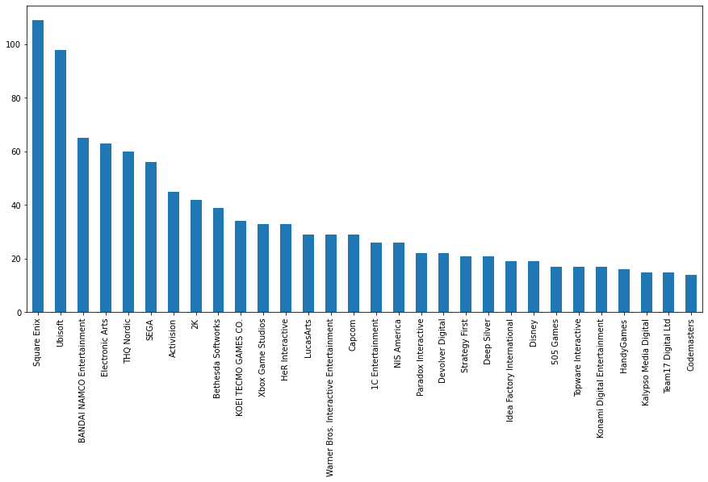


```python
# Developers?
plt.subplots(figsize=(15,7))
esrb['Developer_Primary'].value_counts().nlargest(30).plot.bar(color=['C4'])
```


    <AxesSubplot:>


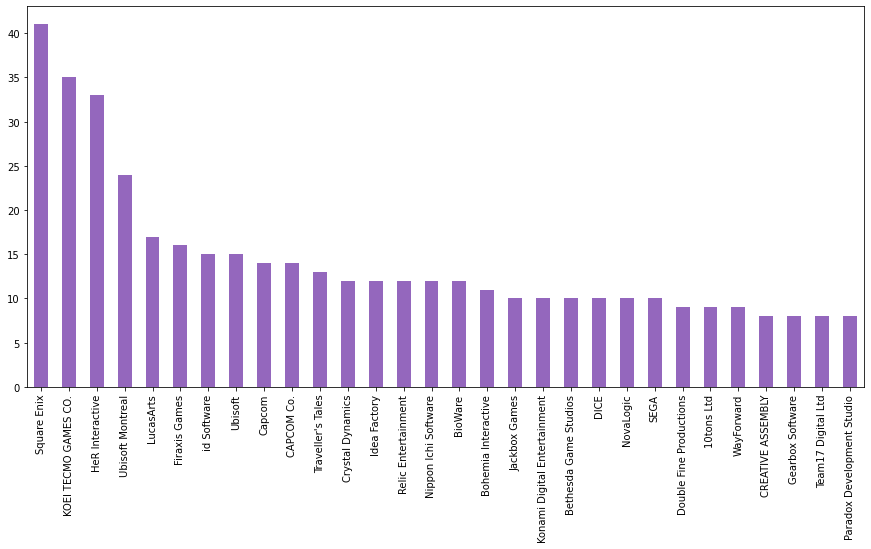


Square Enix seems to be a pretty heavy user of ESRB ratings. Let's take a look at them specifically. I know they are a developer/publisher of Final Fantasy series, as well as many other series of games. That said, let's focus on their Franchise column specifically.


```python
se = esrb.copy()
se = se.loc[se['Publisher_Primary'] == 'Square Enix']
plt.subplots(figsize=(15,7))
se['Franchise'].value_counts().nlargest(30).plot.bar(color=['C7'])
```


    <AxesSubplot:>


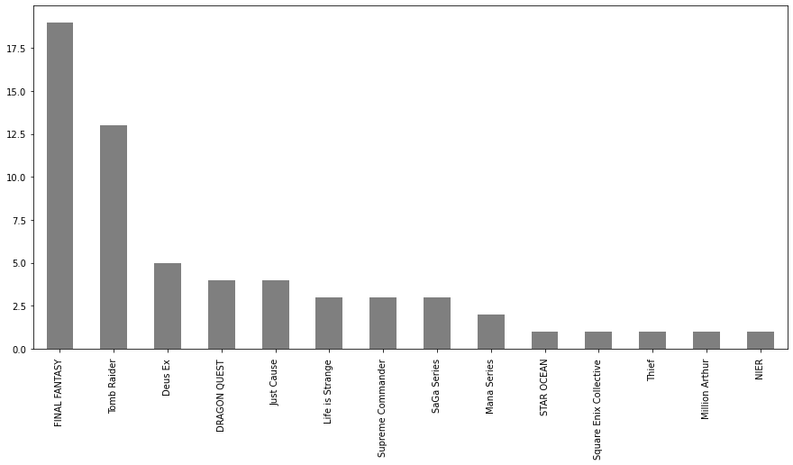


Whew! I didn't know they had 17+ games in their FF series! Suppose there are several "extensions" of various entries in the series though. Tomb Raider Franchise also appears to be a popular series as well. Not sure if those are only the newer versions of Tomb Raider, or if they have a bunch of remakes of the old series from the playstation though.

Alright, now that we've jumped in on ESRB, let's take a look at some of the other breakouts, and see what we can find.


```python
genre.info()
```

    <class 'pandas.core.frame.DataFrame'>
    RangeIndex: 15726 entries, 0 to 15725
    Data columns (total 45 columns):
     #   Column                 Non-Null Count  Dtype  
    ---  ------                 --------------  -----  
     0   PCT_Pos_Rev            4181 non-null   float64
     1   Total_Rev              4181 non-null   float64
     2   Developer_Count        15726 non-null  int64  
     3   Developer_Primary      15726 non-null  object 
     4   Publisher_Count        15726 non-null  int64  
     5   Publisher_Primary      15721 non-null  object 
     6   ESRB                   3391 non-null   object 
     7   ESRBWhy                2510 non-null   object 
     8   Violence               15726 non-null  object 
     9   Blood                  15726 non-null  object 
     10  Language               15726 non-null  object 
     11  Mild                   15726 non-null  object 
     12  Alcohol                15726 non-null  object 
     13  Suggestive             15726 non-null  object 
     14  Sexual                 15726 non-null  object 
     15  Strong                 15726 non-null  object 
     16  Fantasy                15726 non-null  object 
     17  Gore                   15726 non-null  object 
     18  Drug                   15726 non-null  object 
     19  Nudity                 15726 non-null  object 
     20  Tobacco                15726 non-null  object 
     21  Intense                15726 non-null  object 
     22  Partial                15726 non-null  object 
     23  Humor                  15726 non-null  object 
     24  Crude                  15726 non-null  object 
     25  Title                  15726 non-null  object 
     26  Genre                  15726 non-null  object 
     27  Action                 15726 non-null  object 
     28  Adventure              15726 non-null  object 
     29  Casual                 15726 non-null  object 
     30  Early Access           15726 non-null  object 
     31  Free to Play           15726 non-null  object 
     32  Indie                  15726 non-null  object 
     33  Massively Multiplayer  15726 non-null  object 
     34  Racing                 15726 non-null  object 
     35  RPG                    15726 non-null  object 
     36  Simulation             15726 non-null  object 
     37  Sports                 15726 non-null  object 
     38  Strategy               15726 non-null  object 
     39  Franchise              3803 non-null   object 
     40  Franchise_YN           15726 non-null  object 
     41  Franchise_Count        3803 non-null   float64
     42  Price                  15726 non-null  float64
     43  Purchase_Options       15726 non-null  int64  
     44  FinalReleaseDt         15726 non-null  object 
    dtypes: float64(4), int64(3), object(38)
    memory usage: 5.4+ MB
    


```python
# Let's investigate our data, and make sure we don't have any games that have
# an "N" for ALL genre tags that we're interested in. Those could be items that
# skew our data again. First, lets make a copy of the data, and remove unnecessary columns.
gen_f1 = genre.copy()
gen_f1 = gen_f1.iloc[: , 25:39].copy()
gen_f1.head()
```


<div>
<style scoped>
    .dataframe tbody tr th:only-of-type {
        vertical-align: middle;
    }

    .dataframe tbody tr th {
        vertical-align: top;
    }

    .dataframe thead th {
        text-align: right;
    }
</style>
<table border="1" class="dataframe">
  <thead>
    <tr style="text-align: right;">
      <th></th>
      <th>Title</th>
      <th>Genre</th>
      <th>Action</th>
      <th>Adventure</th>
      <th>Casual</th>
      <th>Early Access</th>
      <th>Free to Play</th>
      <th>Indie</th>
      <th>Massively Multiplayer</th>
      <th>Racing</th>
      <th>RPG</th>
      <th>Simulation</th>
      <th>Sports</th>
      <th>Strategy</th>
    </tr>
  </thead>
  <tbody>
    <tr>
      <th>0</th>
      <td>DOOM Eternal</td>
      <td>Action</td>
      <td>Y</td>
      <td>N</td>
      <td>N</td>
      <td>N</td>
      <td>N</td>
      <td>N</td>
      <td>N</td>
      <td>N</td>
      <td>N</td>
      <td>N</td>
      <td>N</td>
      <td>N</td>
    </tr>
    <tr>
      <th>1</th>
      <td>Dota 2</td>
      <td>Action, Free to Play, Strategy</td>
      <td>Y</td>
      <td>N</td>
      <td>N</td>
      <td>N</td>
      <td>Y</td>
      <td>N</td>
      <td>N</td>
      <td>N</td>
      <td>N</td>
      <td>N</td>
      <td>N</td>
      <td>Y</td>
    </tr>
    <tr>
      <th>2</th>
      <td>Halo: The Master Chief Collection</td>
      <td>Action</td>
      <td>Y</td>
      <td>N</td>
      <td>N</td>
      <td>N</td>
      <td>N</td>
      <td>N</td>
      <td>N</td>
      <td>N</td>
      <td>N</td>
      <td>N</td>
      <td>N</td>
      <td>N</td>
    </tr>
    <tr>
      <th>3</th>
      <td>Red Dead Redemption 2</td>
      <td>Action, Adventure</td>
      <td>Y</td>
      <td>Y</td>
      <td>N</td>
      <td>N</td>
      <td>N</td>
      <td>N</td>
      <td>N</td>
      <td>N</td>
      <td>N</td>
      <td>N</td>
      <td>N</td>
      <td>N</td>
    </tr>
    <tr>
      <th>4</th>
      <td>Borderlands 3</td>
      <td>Action, RPG</td>
      <td>Y</td>
      <td>N</td>
      <td>N</td>
      <td>N</td>
      <td>N</td>
      <td>N</td>
      <td>N</td>
      <td>N</td>
      <td>Y</td>
      <td>N</td>
      <td>N</td>
      <td>N</td>
    </tr>
  </tbody>
</table>
</div>


```python
# First check: see if anything is blank in the Genre column
gen_f2 = gen_f1.copy().loc[gen_f1['Genre'] == '']
gen_f2
```


<div>
<style scoped>
    .dataframe tbody tr th:only-of-type {
        vertical-align: middle;
    }

    .dataframe tbody tr th {
        vertical-align: top;
    }

    .dataframe thead th {
        text-align: right;
    }
</style>
<table border="1" class="dataframe">
  <thead>
    <tr style="text-align: right;">
      <th></th>
      <th>Title</th>
      <th>Genre</th>
      <th>Action</th>
      <th>Adventure</th>
      <th>Casual</th>
      <th>Early Access</th>
      <th>Free to Play</th>
      <th>Indie</th>
      <th>Massively Multiplayer</th>
      <th>Racing</th>
      <th>RPG</th>
      <th>Simulation</th>
      <th>Sports</th>
      <th>Strategy</th>
    </tr>
  </thead>
  <tbody>
  </tbody>
</table>
</div>


```python
# Alright, zero results for the first check. let's check one more thing...
# Second check: see if any rows have ALL N's for the Genre tag types.
# first step here, is to convert the Y's and N's into 1's and 0's again.
gen_f3 = gen_f1.copy()
for col in gen_f3.iloc[: , 2:14]:
    gen_f3[col] = gen_f3[col].map({'Y': 1, 'N': 0})
```


```python
# Verify that the loop worked
gen_f3.info()
```

    <class 'pandas.core.frame.DataFrame'>
    RangeIndex: 15726 entries, 0 to 15725
    Data columns (total 14 columns):
     #   Column                 Non-Null Count  Dtype 
    ---  ------                 --------------  ----- 
     0   Title                  15726 non-null  object
     1   Genre                  15726 non-null  object
     2   Action                 15726 non-null  int64 
     3   Adventure              15726 non-null  int64 
     4   Casual                 15726 non-null  int64 
     5   Early Access           15726 non-null  int64 
     6   Free to Play           15726 non-null  int64 
     7   Indie                  15726 non-null  int64 
     8   Massively Multiplayer  15726 non-null  int64 
     9   Racing                 15726 non-null  int64 
     10  RPG                    15726 non-null  int64 
     11  Simulation             15726 non-null  int64 
     12  Sports                 15726 non-null  int64 
     13  Strategy               15726 non-null  int64 
    dtypes: int64(12), object(2)
    memory usage: 1.7+ MB
    


```python
# Next, we sum the binary values of the Y/N results. If the sum = 0, we have an issue.
gen_f3['SumGenres'] = gen_f3.iloc[:, 2:14].sum(axis=1)
gen_f3.loc[gen_f3['SumGenres'] == 0]
```


<div>
<style scoped>
    .dataframe tbody tr th:only-of-type {
        vertical-align: middle;
    }

    .dataframe tbody tr th {
        vertical-align: top;
    }

    .dataframe thead th {
        text-align: right;
    }
</style>
<table border="1" class="dataframe">
  <thead>
    <tr style="text-align: right;">
      <th></th>
      <th>Title</th>
      <th>Genre</th>
      <th>Action</th>
      <th>Adventure</th>
      <th>Casual</th>
      <th>Early Access</th>
      <th>Free to Play</th>
      <th>Indie</th>
      <th>Massively Multiplayer</th>
      <th>Racing</th>
      <th>RPG</th>
      <th>Simulation</th>
      <th>Sports</th>
      <th>Strategy</th>
      <th>SumGenres</th>
    </tr>
  </thead>
  <tbody>
  </tbody>
</table>
</div>


Twice, we have proven that the Genre tags are, pretty much, always present in the game data from Steam. Now let's take a deeper dive into the results, and see what we can discover.


```python
# What game Genre tags have the highest average Prices?
gen_pr1 = genre.copy()
for col in gen_pr1.iloc[: , 27:39]:
    gen_pr = gen_pr1.loc[gen_pr1[col] == 'Y']
    print('$',gen_pr['Price'].mean().round(2),' --> ',col,sep='')

```

    $11.7 --> Action
    $10.9 --> Adventure
    $7.41 --> Casual
    $13.03 --> Early Access
    $0.63 --> Free to Play
    $9.19 --> Indie
    $7.47 --> Massively Multiplayer
    $13.15 --> Racing
    $12.24 --> RPG
    $12.51 --> Simulation
    $14.29 --> Sports
    $12.03 --> Strategy
    

Above view is okay, but it's not great for comparing via visualizations. Let's spice it up, and turn it into a dataframe instead. Once we do that, we can actually view everything as a simple bar chart.


```python
# create an empty dataframe with our two columns we want to use as x and y.
colnames = ['Genre','Avg Price']
gen_pravg = pd.DataFrame(columns=colnames)

# perform the same loop as above, but this time fill in our new dataframe with the values we printed earlier.
for col in gen_pr1.iloc[: , 27:39]:
    gen_pr = gen_pr1.loc[gen_pr1[col] == 'Y']
    gen_pravg.loc[len(gen_pravg)] = [col,gen_pr['Price'].mean().round(2)]
```


```python
# Now sort them, and push into a quick bar chart visualization.
gen_pravg.sort_values(by='Avg Price',inplace=True)
gen_pravg.plot.bar(x='Genre',y='Avg Price',rot=90,color=['C2'])
```


    <AxesSubplot:xlabel='Genre'>


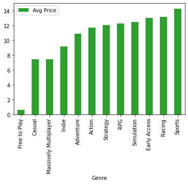


Nothing terribly exciting here, honestly. This tells me a little bit about the cost by genre, but not enough to warrant a strong connection that might be unexpected. Massive Multiplayer tag is probably combined heavily with the "Free to Play" tag, which is why it's at the price average of half of what a usual monthly payment to play the game is (~$15/month). The rest of the games don't seem to have enough of a price gap to warrant any noticeable Genre tag causing a deep change. Genre is another area that we could deep dive into, for several hours. For now, lets move on to the developer and publisher focused data sets.


```python
# Which developers/publishers have the most titles under their belts
plt.subplots(figsize=(15,7))
devpub['Developer_Primary'].value_counts().nlargest(30).plot.bar(color=['C4'])
```


    <AxesSubplot:>


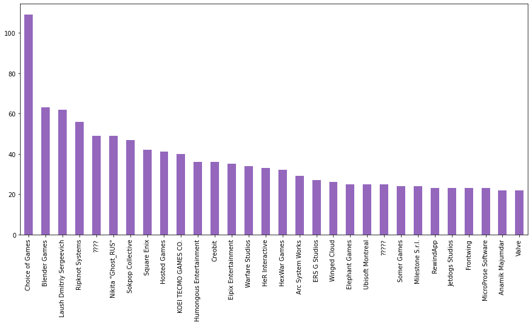


Wow! Choice of Games, I had never even heard of. After going to their developer page on Steam, they have 116 games available! Choice of Games specializes in making text based games. This means they, probably, have a shorter turnaround time for the development process. None of their games are anything that I've heard of, which says a lot about the popularity of their game types. So, in reviewing these developers further, I'm going to guess that I will not have heard of most of the games they've made. Aside form Square Enix and KOEI TECMO, I don't recognize any of these developer studios. Looking at the Developer counts, may not wield us any useful insights, at this point, other than the idea that we don't know the developers of games as well as we should, maybe?

After looking at a few of the ones I haven't heard of, it is clear that there may be some saturation of game developers who are specializing in less popular types of games still. The top 3 developers in this list, seemed to be making games with a "quick and dirty" approach. These developers churned out a bunch of "no-name" games that are not popular on Steam, all of which had low prices.


```python
# Lets take a look at publishers now instead.
plt.subplots(figsize=(15,7))
devpub['Publisher_Primary'].value_counts().nlargest(30).plot.bar(color=['C3'])
```


    <AxesSubplot:>


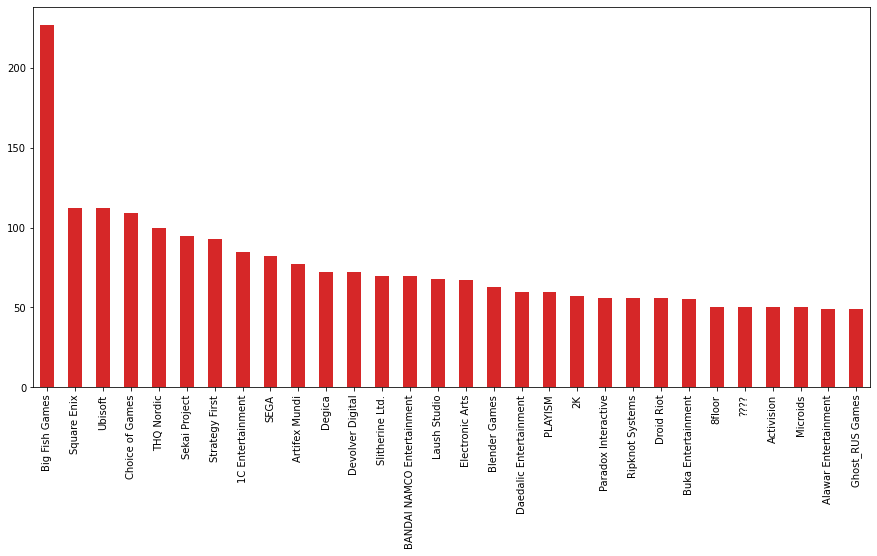


These Publishers are much more familiar to me, which says a lot about the game industry, sadly. Developer studios get far less promotion for their games than the Publishers do. Big Fish Games, in the number 1 spot here, was not a Publisher I'd heard of. Their games are still not popular titles that are mainstream, but their prices are higher than the odd developers we saw in the Developer focus. They are "the largest publisher of Hidden Object games," according to their About page on Steam. I did not know that "Hidden Object games" were a type of game even!

At any rate, we've got the top names in gaming all over this list. Ubisoft, Square Enix, THQ, Sega, Devolver, Bandai, and a slew of others. I thought that we'd see a few more big names here, but I'm gonna guess that the saturation of Developers is also plaguing the list of games from this viewpoint as well. If we had sales data, we could probably look at that, as a much bigger "tell" of which publishers and developers are truly mainstream. We may be able to discern the quality of a publisher or developer, based off of these factors though.

For now, let's break away from EDA, and focus on the next subject here, where we can take a stab at finding correlations and then attempting to make some prediction models. First up, let's see if we can find any correlations in the data, that help predict the percentage of positive reviews (PCT_Pos_Rev).


```python
revs = gms2.copy()
revs = revs[revs['PCT_Pos_Rev'].notna()]
revs['FinalReleaseDt'] = pd.to_datetime(revs['FinalReleaseDt'])
# Create a new column that contains (days since release date as DSRD)
revs['DSRD'] = pd.Timestamp.now().floor('d') - revs['FinalReleaseDt']
revs['DSRD'] = revs['DSRD'].astype('timedelta64[D]').astype(int)
revs.head(3)
```


<div>
<style scoped>
    .dataframe tbody tr th:only-of-type {
        vertical-align: middle;
    }

    .dataframe tbody tr th {
        vertical-align: top;
    }

    .dataframe thead th {
        text-align: right;
    }
</style>
<table border="1" class="dataframe">
  <thead>
    <tr style="text-align: right;">
      <th></th>
      <th>PCT_Pos_Rev</th>
      <th>Total_Rev</th>
      <th>Developer_Count</th>
      <th>Developer_Primary</th>
      <th>Publisher_Count</th>
      <th>Publisher_Primary</th>
      <th>ESRB</th>
      <th>ESRBWhy</th>
      <th>Violence</th>
      <th>Blood</th>
      <th>...</th>
      <th>Simulation</th>
      <th>Sports</th>
      <th>Strategy</th>
      <th>Franchise</th>
      <th>Franchise_YN</th>
      <th>Franchise_Count</th>
      <th>Price</th>
      <th>Purchase_Options</th>
      <th>FinalReleaseDt</th>
      <th>DSRD</th>
    </tr>
  </thead>
  <tbody>
    <tr>
      <th>0</th>
      <td>85.0</td>
      <td>59927.0</td>
      <td>1</td>
      <td>id Software</td>
      <td>1</td>
      <td>Bethesda Softworks</td>
      <td>m</td>
      <td>Blood and Gore| Intense Violence</td>
      <td>Y</td>
      <td>Y</td>
      <td>...</td>
      <td>N</td>
      <td>N</td>
      <td>N</td>
      <td>DOOM</td>
      <td>Y</td>
      <td>9.0</td>
      <td>59.99</td>
      <td>3</td>
      <td>2020-03-19</td>
      <td>145</td>
    </tr>
    <tr>
      <th>1</th>
      <td>84.0</td>
      <td>1333619.0</td>
      <td>1</td>
      <td>Valve</td>
      <td>1</td>
      <td>Valve</td>
      <td>NaN</td>
      <td>NaN</td>
      <td>N</td>
      <td>N</td>
      <td>...</td>
      <td>N</td>
      <td>N</td>
      <td>Y</td>
      <td>NaN</td>
      <td>N</td>
      <td>NaN</td>
      <td>0.00</td>
      <td>2</td>
      <td>2013-07-09</td>
      <td>2590</td>
    </tr>
    <tr>
      <th>2</th>
      <td>91.0</td>
      <td>86340.0</td>
      <td>5</td>
      <td>343 Industries</td>
      <td>1</td>
      <td>Xbox Game Studios</td>
      <td>m</td>
      <td>Blood and Gore| Violence| Language</td>
      <td>Y</td>
      <td>Y</td>
      <td>...</td>
      <td>N</td>
      <td>N</td>
      <td>N</td>
      <td>Halo</td>
      <td>Y</td>
      <td>1.0</td>
      <td>39.99</td>
      <td>2</td>
      <td>2019-12-03</td>
      <td>252</td>
    </tr>
  </tbody>
</table>
<p>3 rows × 46 columns</p>
</div>


```python
revs = revs.drop(['ESRB',
                  'ESRBWhy',
                  'Developer_Primary',
                  'Publisher_Primary' ,
                  'Title', 
                  'Franchise',
                  'Genre',
                  'FinalReleaseDt'], axis=1)

for column in revs:
    if revs[column].dtype == object:
        revs[column] = revs[column].map({'Y': 1, 'N': 0})
```


```python
revs.info()
```

    <class 'pandas.core.frame.DataFrame'>
    Int64Index: 4181 entries, 0 to 15597
    Data columns (total 38 columns):
     #   Column                 Non-Null Count  Dtype  
    ---  ------                 --------------  -----  
     0   PCT_Pos_Rev            4181 non-null   float64
     1   Total_Rev              4181 non-null   float64
     2   Developer_Count        4181 non-null   int64  
     3   Publisher_Count        4181 non-null   int64  
     4   Violence               4181 non-null   int64  
     5   Blood                  4181 non-null   int64  
     6   Language               4181 non-null   int64  
     7   Mild                   4181 non-null   int64  
     8   Alcohol                4181 non-null   int64  
     9   Suggestive             4181 non-null   int64  
     10  Sexual                 4181 non-null   int64  
     11  Strong                 4181 non-null   int64  
     12  Fantasy                4181 non-null   int64  
     13  Gore                   4181 non-null   int64  
     14  Drug                   4181 non-null   int64  
     15  Nudity                 4181 non-null   int64  
     16  Tobacco                4181 non-null   int64  
     17  Intense                4181 non-null   int64  
     18  Partial                4181 non-null   int64  
     19  Humor                  4181 non-null   int64  
     20  Crude                  4181 non-null   int64  
     21  Action                 4181 non-null   int64  
     22  Adventure              4181 non-null   int64  
     23  Casual                 4181 non-null   int64  
     24  Early Access           4181 non-null   int64  
     25  Free to Play           4181 non-null   int64  
     26  Indie                  4181 non-null   int64  
     27  Massively Multiplayer  4181 non-null   int64  
     28  Racing                 4181 non-null   int64  
     29  RPG                    4181 non-null   int64  
     30  Simulation             4181 non-null   int64  
     31  Sports                 4181 non-null   int64  
     32  Strategy               4181 non-null   int64  
     33  Franchise_YN           4181 non-null   int64  
     34  Franchise_Count        1449 non-null   float64
     35  Price                  4181 non-null   float64
     36  Purchase_Options       4181 non-null   int64  
     37  DSRD                   4181 non-null   int32  
    dtypes: float64(4), int32(1), int64(33)
    memory usage: 1.2 MB
    


```python
# sns.pairplot(revs)
# sns.heatmap(df_new.corr())
plt.subplots(figsize=(25,20))
sns.heatmap(revs.corr(), annot=True)
```


    <AxesSubplot:>


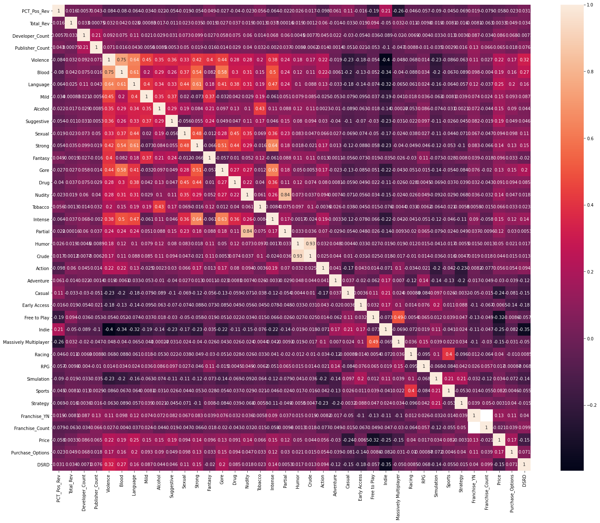


As you can see, the column "PCT_Pos_Rev" does not correlate well with anything, really. The highest correlation point was for the Genre tag of Indie, which was still a very low correlation, sitting at .21. However, we're going to try and see if we can still manage to find some accuracy when using a linear regression prediction model. 


```python
revs2 = revs.copy()
revs = revs.drop(['Franchise_Count'], axis=1)
msk = np.random.rand(len(revs)) < .8
train = revs[msk]
test = revs[~msk]
train.info()
```

    <class 'pandas.core.frame.DataFrame'>
    Int64Index: 3321 entries, 0 to 15597
    Data columns (total 37 columns):
     #   Column                 Non-Null Count  Dtype  
    ---  ------                 --------------  -----  
     0   PCT_Pos_Rev            3321 non-null   float64
     1   Total_Rev              3321 non-null   float64
     2   Developer_Count        3321 non-null   int64  
     3   Publisher_Count        3321 non-null   int64  
     4   Violence               3321 non-null   int64  
     5   Blood                  3321 non-null   int64  
     6   Language               3321 non-null   int64  
     7   Mild                   3321 non-null   int64  
     8   Alcohol                3321 non-null   int64  
     9   Suggestive             3321 non-null   int64  
     10  Sexual                 3321 non-null   int64  
     11  Strong                 3321 non-null   int64  
     12  Fantasy                3321 non-null   int64  
     13  Gore                   3321 non-null   int64  
     14  Drug                   3321 non-null   int64  
     15  Nudity                 3321 non-null   int64  
     16  Tobacco                3321 non-null   int64  
     17  Intense                3321 non-null   int64  
     18  Partial                3321 non-null   int64  
     19  Humor                  3321 non-null   int64  
     20  Crude                  3321 non-null   int64  
     21  Action                 3321 non-null   int64  
     22  Adventure              3321 non-null   int64  
     23  Casual                 3321 non-null   int64  
     24  Early Access           3321 non-null   int64  
     25  Free to Play           3321 non-null   int64  
     26  Indie                  3321 non-null   int64  
     27  Massively Multiplayer  3321 non-null   int64  
     28  Racing                 3321 non-null   int64  
     29  RPG                    3321 non-null   int64  
     30  Simulation             3321 non-null   int64  
     31  Sports                 3321 non-null   int64  
     32  Strategy               3321 non-null   int64  
     33  Franchise_YN           3321 non-null   int64  
     34  Price                  3321 non-null   float64
     35  Purchase_Options       3321 non-null   int64  
     36  DSRD                   3321 non-null   int32  
    dtypes: float64(3), int32(1), int64(33)
    memory usage: 972.9 KB
    


```python
x_train = train.iloc[:,1:37]
x_test = test.iloc[:,1:37]

y_train = train['PCT_Pos_Rev']
y_test = test['PCT_Pos_Rev']

x_train.info()
```

    <class 'pandas.core.frame.DataFrame'>
    Int64Index: 3321 entries, 0 to 15597
    Data columns (total 36 columns):
     #   Column                 Non-Null Count  Dtype  
    ---  ------                 --------------  -----  
     0   Total_Rev              3321 non-null   float64
     1   Developer_Count        3321 non-null   int64  
     2   Publisher_Count        3321 non-null   int64  
     3   Violence               3321 non-null   int64  
     4   Blood                  3321 non-null   int64  
     5   Language               3321 non-null   int64  
     6   Mild                   3321 non-null   int64  
     7   Alcohol                3321 non-null   int64  
     8   Suggestive             3321 non-null   int64  
     9   Sexual                 3321 non-null   int64  
     10  Strong                 3321 non-null   int64  
     11  Fantasy                3321 non-null   int64  
     12  Gore                   3321 non-null   int64  
     13  Drug                   3321 non-null   int64  
     14  Nudity                 3321 non-null   int64  
     15  Tobacco                3321 non-null   int64  
     16  Intense                3321 non-null   int64  
     17  Partial                3321 non-null   int64  
     18  Humor                  3321 non-null   int64  
     19  Crude                  3321 non-null   int64  
     20  Action                 3321 non-null   int64  
     21  Adventure              3321 non-null   int64  
     22  Casual                 3321 non-null   int64  
     23  Early Access           3321 non-null   int64  
     24  Free to Play           3321 non-null   int64  
     25  Indie                  3321 non-null   int64  
     26  Massively Multiplayer  3321 non-null   int64  
     27  Racing                 3321 non-null   int64  
     28  RPG                    3321 non-null   int64  
     29  Simulation             3321 non-null   int64  
     30  Sports                 3321 non-null   int64  
     31  Strategy               3321 non-null   int64  
     32  Franchise_YN           3321 non-null   int64  
     33  Price                  3321 non-null   float64
     34  Purchase_Options       3321 non-null   int64  
     35  DSRD                   3321 non-null   int32  
    dtypes: float64(2), int32(1), int64(33)
    memory usage: 947.0 KB
    


```python
lm = linear_model.LinearRegression()
model = lm.fit(x_train,y_train)
predictions = lm.predict(x_test)
```


```python
pred = pd.DataFrame(predictions)
pred.columns = ['RevPredicted']
revs3 = x_test.join(y_test)
revs3 = revs3.join(pred)
revs3['Review_Diff'] = revs3['RevPredicted'] - revs3['PCT_Pos_Rev'] 
revs3.head()
```


<div>
<style scoped>
    .dataframe tbody tr th:only-of-type {
        vertical-align: middle;
    }

    .dataframe tbody tr th {
        vertical-align: top;
    }

    .dataframe thead th {
        text-align: right;
    }
</style>
<table border="1" class="dataframe">
  <thead>
    <tr style="text-align: right;">
      <th></th>
      <th>Total_Rev</th>
      <th>Developer_Count</th>
      <th>Publisher_Count</th>
      <th>Violence</th>
      <th>Blood</th>
      <th>Language</th>
      <th>Mild</th>
      <th>Alcohol</th>
      <th>Suggestive</th>
      <th>Sexual</th>
      <th>...</th>
      <th>Simulation</th>
      <th>Sports</th>
      <th>Strategy</th>
      <th>Franchise_YN</th>
      <th>Price</th>
      <th>Purchase_Options</th>
      <th>DSRD</th>
      <th>PCT_Pos_Rev</th>
      <th>RevPredicted</th>
      <th>Review_Diff</th>
    </tr>
  </thead>
  <tbody>
    <tr>
      <th>1</th>
      <td>1333619.0</td>
      <td>1</td>
      <td>1</td>
      <td>0</td>
      <td>0</td>
      <td>0</td>
      <td>0</td>
      <td>0</td>
      <td>0</td>
      <td>0</td>
      <td>...</td>
      <td>0</td>
      <td>0</td>
      <td>1</td>
      <td>0</td>
      <td>0.00</td>
      <td>2</td>
      <td>2590</td>
      <td>84.0</td>
      <td>82.769917</td>
      <td>-1.230083</td>
    </tr>
    <tr>
      <th>2</th>
      <td>86340.0</td>
      <td>5</td>
      <td>1</td>
      <td>1</td>
      <td>1</td>
      <td>1</td>
      <td>0</td>
      <td>0</td>
      <td>0</td>
      <td>0</td>
      <td>...</td>
      <td>0</td>
      <td>0</td>
      <td>0</td>
      <td>1</td>
      <td>39.99</td>
      <td>2</td>
      <td>252</td>
      <td>91.0</td>
      <td>188.946046</td>
      <td>97.946046</td>
    </tr>
    <tr>
      <th>9</th>
      <td>4562019.0</td>
      <td>2</td>
      <td>1</td>
      <td>0</td>
      <td>0</td>
      <td>0</td>
      <td>0</td>
      <td>0</td>
      <td>0</td>
      <td>0</td>
      <td>...</td>
      <td>0</td>
      <td>0</td>
      <td>0</td>
      <td>0</td>
      <td>0.00</td>
      <td>2</td>
      <td>2912</td>
      <td>87.0</td>
      <td>80.548437</td>
      <td>-6.451563</td>
    </tr>
    <tr>
      <th>18</th>
      <td>130856.0</td>
      <td>1</td>
      <td>1</td>
      <td>1</td>
      <td>0</td>
      <td>0</td>
      <td>0</td>
      <td>0</td>
      <td>0</td>
      <td>0</td>
      <td>...</td>
      <td>0</td>
      <td>0</td>
      <td>0</td>
      <td>0</td>
      <td>59.99</td>
      <td>1</td>
      <td>1460</td>
      <td>61.0</td>
      <td>86.014242</td>
      <td>25.014242</td>
    </tr>
    <tr>
      <th>24</th>
      <td>62929.0</td>
      <td>7</td>
      <td>1</td>
      <td>1</td>
      <td>1</td>
      <td>1</td>
      <td>0</td>
      <td>0</td>
      <td>0</td>
      <td>1</td>
      <td>...</td>
      <td>0</td>
      <td>0</td>
      <td>0</td>
      <td>1</td>
      <td>59.99</td>
      <td>5</td>
      <td>676</td>
      <td>88.0</td>
      <td>78.340831</td>
      <td>-9.659169</td>
    </tr>
  </tbody>
</table>
<p>5 rows × 39 columns</p>
</div>


```python
def GetModelInfo(ytest, predvals, predname, diffname, dafra):
    print(f'Mean squared error (closer to 0 is better): {mean_squared_error(ytest, predvals)}')
    print(f'r2 score (1 is perfect): {r2_score(ytest, predvals)}')

    predcol = dafra[predname]
    diffcol = dafra[diffname]

    plt.figure(figsize=(16, 6))
    plt.ylim(diffcol.min(), diffcol.max())
    plt.xlim(predcol.min(),predcol.max())
    sns.scatterplot(x=predname, y=diffname, data=dafra)

    X_plot = np.linspace(predcol.min(),predcol.max(), 10)
    Y_plot = np.linspace(0, 0, 10)

    plt.plot(X_plot, Y_plot, color='r')
```


```python
GetModelInfo(y_test,pred,'RevPredicted','Review_Diff',revs3)
```

    Mean squared error (closer to 0 is better): 140.65011113112897
    r2 score (1 is perfect): 0.03882954016692275
    


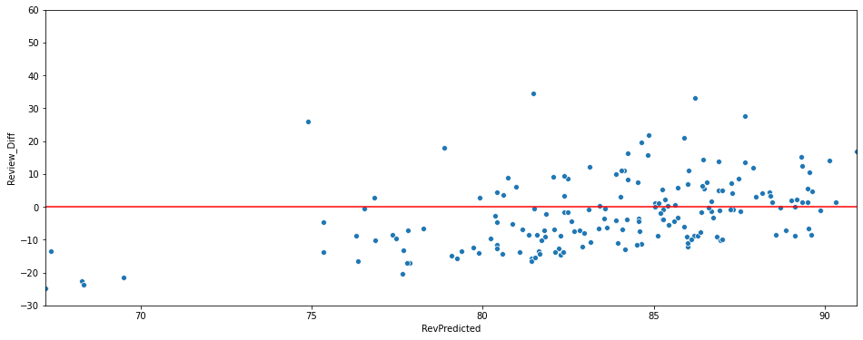


```python
prc = gms2.copy()

prc['FinalReleaseDt'] = pd.to_datetime(prc['FinalReleaseDt'])
# Create the days since release date column again (DSRD)
prc['DSRD'] = pd.Timestamp.now().floor('d') - prc['FinalReleaseDt']
prc['DSRD'] = prc['DSRD'].astype('timedelta64[D]').astype(int)

prc = prc.drop(['PCT_Pos_Rev',
                'Total_Rev',
                'ESRB',
                'ESRBWhy',
                'Developer_Primary',
                'Publisher_Primary' ,
                'Title', 
                'Franchise',
                'Genre',
                'FinalReleaseDt'], axis=1)

for column in prc:
    if prc[column].dtype == object:
        prc[column] = prc[column].map({'Y': 1, 'N': 0})
```


```python
prc['Franchise_Count'].value_counts().plot.bar()
```


    <AxesSubplot:>


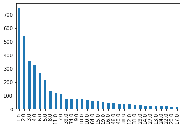


```python
prc['Franchise_Count'].head(5)
```


    0    9.0
    1    NaN
    2    1.0
    3    1.0
    4    4.0
    Name: Franchise_Count, dtype: float64


```python
values = {'Franchise_Count': 0}
prc = prc.fillna(value=values)
prc['Franchise_Count'].head(5)
```


    0    9.0
    1    0.0
    2    1.0
    3    1.0
    4    4.0
    Name: Franchise_Count, dtype: float64


```python
prc['Franchise_Count'].value_counts().plot.bar()
```


    <AxesSubplot:>


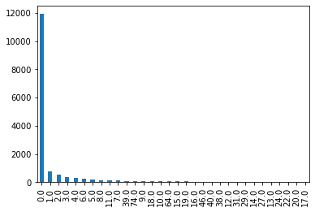


```python
prc.info()
```

    <class 'pandas.core.frame.DataFrame'>
    RangeIndex: 15726 entries, 0 to 15725
    Data columns (total 36 columns):
     #   Column                 Non-Null Count  Dtype  
    ---  ------                 --------------  -----  
     0   Developer_Count        15726 non-null  int64  
     1   Publisher_Count        15726 non-null  int64  
     2   Violence               15726 non-null  int64  
     3   Blood                  15726 non-null  int64  
     4   Language               15726 non-null  int64  
     5   Mild                   15726 non-null  int64  
     6   Alcohol                15726 non-null  int64  
     7   Suggestive             15726 non-null  int64  
     8   Sexual                 15726 non-null  int64  
     9   Strong                 15726 non-null  int64  
     10  Fantasy                15726 non-null  int64  
     11  Gore                   15726 non-null  int64  
     12  Drug                   15726 non-null  int64  
     13  Nudity                 15726 non-null  int64  
     14  Tobacco                15726 non-null  int64  
     15  Intense                15726 non-null  int64  
     16  Partial                15726 non-null  int64  
     17  Humor                  15726 non-null  int64  
     18  Crude                  15726 non-null  int64  
     19  Action                 15726 non-null  int64  
     20  Adventure              15726 non-null  int64  
     21  Casual                 15726 non-null  int64  
     22  Early Access           15726 non-null  int64  
     23  Free to Play           15726 non-null  int64  
     24  Indie                  15726 non-null  int64  
     25  Massively Multiplayer  15726 non-null  int64  
     26  Racing                 15726 non-null  int64  
     27  RPG                    15726 non-null  int64  
     28  Simulation             15726 non-null  int64  
     29  Sports                 15726 non-null  int64  
     30  Strategy               15726 non-null  int64  
     31  Franchise_YN           15726 non-null  int64  
     32  Franchise_Count        15726 non-null  float64
     33  Price                  15726 non-null  float64
     34  Purchase_Options       15726 non-null  int64  
     35  DSRD                   15726 non-null  int32  
    dtypes: float64(2), int32(1), int64(33)
    memory usage: 4.3 MB
    

There we go. Nice clean data set of 15.7k rows. Now, let's see if we can find any correlations.


```python
plt.subplots(figsize=(25,20))
sns.heatmap(prc.corr(), annot=True)
```


    <AxesSubplot:>


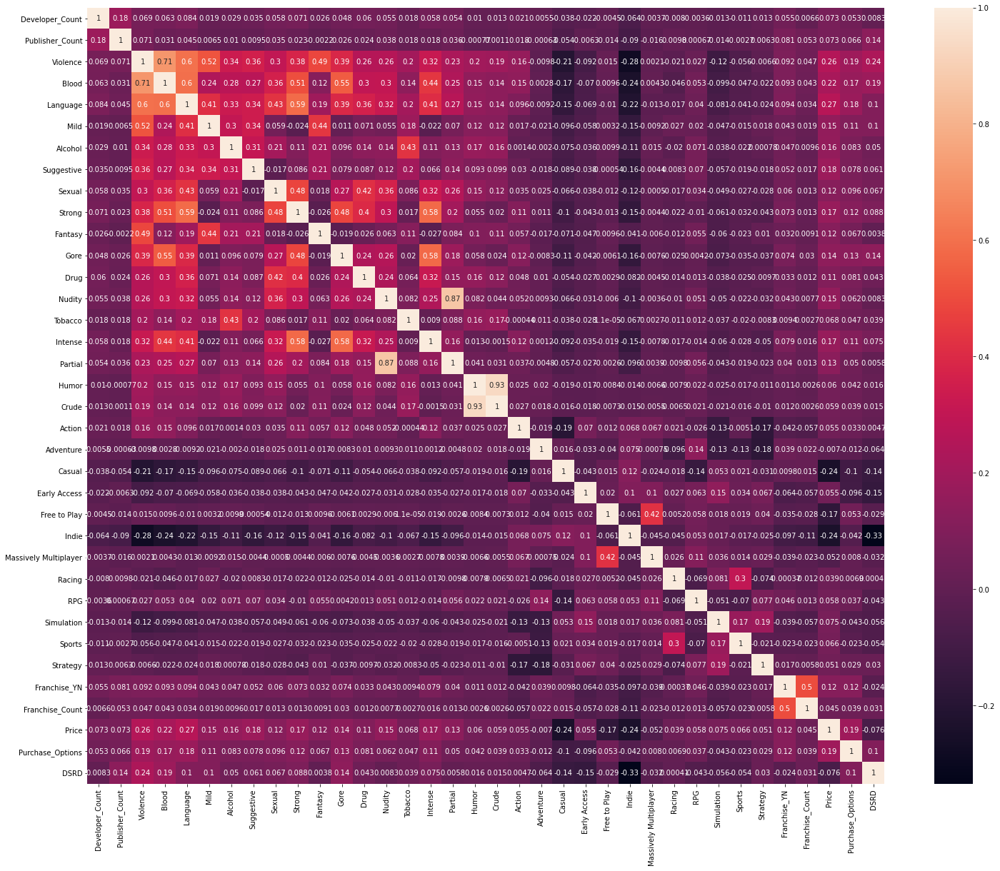


Welp, not so good correlation for the Price column either. At least for this column, we have a stronger correlation based off of a few of the ESRB values. I would wager that this is occurring because the companies that are actually popular enough to feel it necessary to obtain the ESRB ratings, generally have a popular product. Popular product equals more expensive product in this sense as well. At any rate, let's see what a linear model can get for us, with this data.


```python
prc_col = prc['Price']
prc.drop(labels=['Price'], axis=1,inplace = True)
prc.insert(0, 'Price', prc_col)
prc.head()
```


<div>
<style scoped>
    .dataframe tbody tr th:only-of-type {
        vertical-align: middle;
    }

    .dataframe tbody tr th {
        vertical-align: top;
    }

    .dataframe thead th {
        text-align: right;
    }
</style>
<table border="1" class="dataframe">
  <thead>
    <tr style="text-align: right;">
      <th></th>
      <th>Price</th>
      <th>Developer_Count</th>
      <th>Publisher_Count</th>
      <th>Violence</th>
      <th>Blood</th>
      <th>Language</th>
      <th>Mild</th>
      <th>Alcohol</th>
      <th>Suggestive</th>
      <th>Sexual</th>
      <th>...</th>
      <th>Massively Multiplayer</th>
      <th>Racing</th>
      <th>RPG</th>
      <th>Simulation</th>
      <th>Sports</th>
      <th>Strategy</th>
      <th>Franchise_YN</th>
      <th>Franchise_Count</th>
      <th>Purchase_Options</th>
      <th>DSRD</th>
    </tr>
  </thead>
  <tbody>
    <tr>
      <th>0</th>
      <td>59.99</td>
      <td>1</td>
      <td>1</td>
      <td>1</td>
      <td>1</td>
      <td>0</td>
      <td>0</td>
      <td>0</td>
      <td>0</td>
      <td>0</td>
      <td>...</td>
      <td>0</td>
      <td>0</td>
      <td>0</td>
      <td>0</td>
      <td>0</td>
      <td>0</td>
      <td>1</td>
      <td>9.0</td>
      <td>3</td>
      <td>145</td>
    </tr>
    <tr>
      <th>1</th>
      <td>0.00</td>
      <td>1</td>
      <td>1</td>
      <td>0</td>
      <td>0</td>
      <td>0</td>
      <td>0</td>
      <td>0</td>
      <td>0</td>
      <td>0</td>
      <td>...</td>
      <td>0</td>
      <td>0</td>
      <td>0</td>
      <td>0</td>
      <td>0</td>
      <td>1</td>
      <td>0</td>
      <td>0.0</td>
      <td>2</td>
      <td>2590</td>
    </tr>
    <tr>
      <th>2</th>
      <td>39.99</td>
      <td>5</td>
      <td>1</td>
      <td>1</td>
      <td>1</td>
      <td>1</td>
      <td>0</td>
      <td>0</td>
      <td>0</td>
      <td>0</td>
      <td>...</td>
      <td>0</td>
      <td>0</td>
      <td>0</td>
      <td>0</td>
      <td>0</td>
      <td>0</td>
      <td>1</td>
      <td>1.0</td>
      <td>2</td>
      <td>252</td>
    </tr>
    <tr>
      <th>3</th>
      <td>59.99</td>
      <td>1</td>
      <td>1</td>
      <td>1</td>
      <td>1</td>
      <td>1</td>
      <td>0</td>
      <td>1</td>
      <td>0</td>
      <td>1</td>
      <td>...</td>
      <td>0</td>
      <td>0</td>
      <td>0</td>
      <td>0</td>
      <td>0</td>
      <td>0</td>
      <td>1</td>
      <td>1.0</td>
      <td>3</td>
      <td>250</td>
    </tr>
    <tr>
      <th>4</th>
      <td>59.99</td>
      <td>1</td>
      <td>1</td>
      <td>1</td>
      <td>1</td>
      <td>1</td>
      <td>0</td>
      <td>0</td>
      <td>0</td>
      <td>1</td>
      <td>...</td>
      <td>0</td>
      <td>0</td>
      <td>1</td>
      <td>0</td>
      <td>0</td>
      <td>0</td>
      <td>1</td>
      <td>4.0</td>
      <td>4</td>
      <td>151</td>
    </tr>
  </tbody>
</table>
<p>5 rows × 36 columns</p>
</div>


```python
msk = np.random.rand(len(prc)) < .8
train = prc[msk]
test = prc[~msk]
train.info()
```

    <class 'pandas.core.frame.DataFrame'>
    Int64Index: 12605 entries, 0 to 15725
    Data columns (total 36 columns):
     #   Column                 Non-Null Count  Dtype  
    ---  ------                 --------------  -----  
     0   Price                  12605 non-null  float64
     1   Developer_Count        12605 non-null  int64  
     2   Publisher_Count        12605 non-null  int64  
     3   Violence               12605 non-null  int64  
     4   Blood                  12605 non-null  int64  
     5   Language               12605 non-null  int64  
     6   Mild                   12605 non-null  int64  
     7   Alcohol                12605 non-null  int64  
     8   Suggestive             12605 non-null  int64  
     9   Sexual                 12605 non-null  int64  
     10  Strong                 12605 non-null  int64  
     11  Fantasy                12605 non-null  int64  
     12  Gore                   12605 non-null  int64  
     13  Drug                   12605 non-null  int64  
     14  Nudity                 12605 non-null  int64  
     15  Tobacco                12605 non-null  int64  
     16  Intense                12605 non-null  int64  
     17  Partial                12605 non-null  int64  
     18  Humor                  12605 non-null  int64  
     19  Crude                  12605 non-null  int64  
     20  Action                 12605 non-null  int64  
     21  Adventure              12605 non-null  int64  
     22  Casual                 12605 non-null  int64  
     23  Early Access           12605 non-null  int64  
     24  Free to Play           12605 non-null  int64  
     25  Indie                  12605 non-null  int64  
     26  Massively Multiplayer  12605 non-null  int64  
     27  Racing                 12605 non-null  int64  
     28  RPG                    12605 non-null  int64  
     29  Simulation             12605 non-null  int64  
     30  Sports                 12605 non-null  int64  
     31  Strategy               12605 non-null  int64  
     32  Franchise_YN           12605 non-null  int64  
     33  Franchise_Count        12605 non-null  float64
     34  Purchase_Options       12605 non-null  int64  
     35  DSRD                   12605 non-null  int32  
    dtypes: float64(2), int32(1), int64(33)
    memory usage: 3.5 MB
    


```python
x_train = train.iloc[:,1:36]
x_test = test.iloc[:,1:36]

y_train = train['Price']
y_test = test['Price']

x_train.info()
```

    <class 'pandas.core.frame.DataFrame'>
    Int64Index: 12605 entries, 0 to 15725
    Data columns (total 35 columns):
     #   Column                 Non-Null Count  Dtype  
    ---  ------                 --------------  -----  
     0   Developer_Count        12605 non-null  int64  
     1   Publisher_Count        12605 non-null  int64  
     2   Violence               12605 non-null  int64  
     3   Blood                  12605 non-null  int64  
     4   Language               12605 non-null  int64  
     5   Mild                   12605 non-null  int64  
     6   Alcohol                12605 non-null  int64  
     7   Suggestive             12605 non-null  int64  
     8   Sexual                 12605 non-null  int64  
     9   Strong                 12605 non-null  int64  
     10  Fantasy                12605 non-null  int64  
     11  Gore                   12605 non-null  int64  
     12  Drug                   12605 non-null  int64  
     13  Nudity                 12605 non-null  int64  
     14  Tobacco                12605 non-null  int64  
     15  Intense                12605 non-null  int64  
     16  Partial                12605 non-null  int64  
     17  Humor                  12605 non-null  int64  
     18  Crude                  12605 non-null  int64  
     19  Action                 12605 non-null  int64  
     20  Adventure              12605 non-null  int64  
     21  Casual                 12605 non-null  int64  
     22  Early Access           12605 non-null  int64  
     23  Free to Play           12605 non-null  int64  
     24  Indie                  12605 non-null  int64  
     25  Massively Multiplayer  12605 non-null  int64  
     26  Racing                 12605 non-null  int64  
     27  RPG                    12605 non-null  int64  
     28  Simulation             12605 non-null  int64  
     29  Sports                 12605 non-null  int64  
     30  Strategy               12605 non-null  int64  
     31  Franchise_YN           12605 non-null  int64  
     32  Franchise_Count        12605 non-null  float64
     33  Purchase_Options       12605 non-null  int64  
     34  DSRD                   12605 non-null  int32  
    dtypes: float64(1), int32(1), int64(33)
    memory usage: 3.4 MB
    


```python
lm = linear_model.LinearRegression()
model = lm.fit(x_train,y_train)
predictions = lm.predict(x_test)
```


```python
pred = pd.DataFrame(predictions)
pred.columns = ['PricePredicted']
prc2 = x_test.join(y_test)
prc2 = prc2.join(pred)
prc2['Price_Diff'] = prc2['PricePredicted'] - prc2['Price'] 
prc2.head()
```


<div>
<style scoped>
    .dataframe tbody tr th:only-of-type {
        vertical-align: middle;
    }

    .dataframe tbody tr th {
        vertical-align: top;
    }

    .dataframe thead th {
        text-align: right;
    }
</style>
<table border="1" class="dataframe">
  <thead>
    <tr style="text-align: right;">
      <th></th>
      <th>Developer_Count</th>
      <th>Publisher_Count</th>
      <th>Violence</th>
      <th>Blood</th>
      <th>Language</th>
      <th>Mild</th>
      <th>Alcohol</th>
      <th>Suggestive</th>
      <th>Sexual</th>
      <th>Strong</th>
      <th>...</th>
      <th>Simulation</th>
      <th>Sports</th>
      <th>Strategy</th>
      <th>Franchise_YN</th>
      <th>Franchise_Count</th>
      <th>Purchase_Options</th>
      <th>DSRD</th>
      <th>Price</th>
      <th>PricePredicted</th>
      <th>Price_Diff</th>
    </tr>
  </thead>
  <tbody>
    <tr>
      <th>10</th>
      <td>1</td>
      <td>1</td>
      <td>0</td>
      <td>0</td>
      <td>0</td>
      <td>0</td>
      <td>0</td>
      <td>0</td>
      <td>0</td>
      <td>0</td>
      <td>...</td>
      <td>0</td>
      <td>0</td>
      <td>0</td>
      <td>0</td>
      <td>0.0</td>
      <td>2</td>
      <td>90</td>
      <td>29.99</td>
      <td>19.332045</td>
      <td>-10.657955</td>
    </tr>
    <tr>
      <th>16</th>
      <td>1</td>
      <td>1</td>
      <td>1</td>
      <td>1</td>
      <td>1</td>
      <td>0</td>
      <td>0</td>
      <td>0</td>
      <td>0</td>
      <td>1</td>
      <td>...</td>
      <td>0</td>
      <td>0</td>
      <td>0</td>
      <td>0</td>
      <td>0.0</td>
      <td>3</td>
      <td>1519</td>
      <td>19.99</td>
      <td>14.636958</td>
      <td>-5.353042</td>
    </tr>
    <tr>
      <th>25</th>
      <td>1</td>
      <td>1</td>
      <td>0</td>
      <td>0</td>
      <td>0</td>
      <td>0</td>
      <td>0</td>
      <td>0</td>
      <td>0</td>
      <td>0</td>
      <td>...</td>
      <td>0</td>
      <td>0</td>
      <td>0</td>
      <td>0</td>
      <td>0.0</td>
      <td>2</td>
      <td>915</td>
      <td>39.99</td>
      <td>39.345882</td>
      <td>-0.644118</td>
    </tr>
    <tr>
      <th>30</th>
      <td>1</td>
      <td>1</td>
      <td>1</td>
      <td>1</td>
      <td>0</td>
      <td>0</td>
      <td>1</td>
      <td>0</td>
      <td>1</td>
      <td>0</td>
      <td>...</td>
      <td>0</td>
      <td>0</td>
      <td>0</td>
      <td>1</td>
      <td>2.0</td>
      <td>1</td>
      <td>1384</td>
      <td>39.99</td>
      <td>9.224426</td>
      <td>-30.765574</td>
    </tr>
    <tr>
      <th>34</th>
      <td>2</td>
      <td>2</td>
      <td>1</td>
      <td>1</td>
      <td>1</td>
      <td>0</td>
      <td>0</td>
      <td>0</td>
      <td>0</td>
      <td>1</td>
      <td>...</td>
      <td>0</td>
      <td>0</td>
      <td>0</td>
      <td>0</td>
      <td>0.0</td>
      <td>4</td>
      <td>1741</td>
      <td>59.99</td>
      <td>33.164849</td>
      <td>-26.825151</td>
    </tr>
  </tbody>
</table>
<p>5 rows × 38 columns</p>
</div>


```python
GetModelInfo(y_test,pred,'PricePredicted','Price_Diff',prc2)
```

    Mean squared error (closer to 0 is better): 65.625212861764
    r2 score (1 is perfect): 0.2864238182843898
    


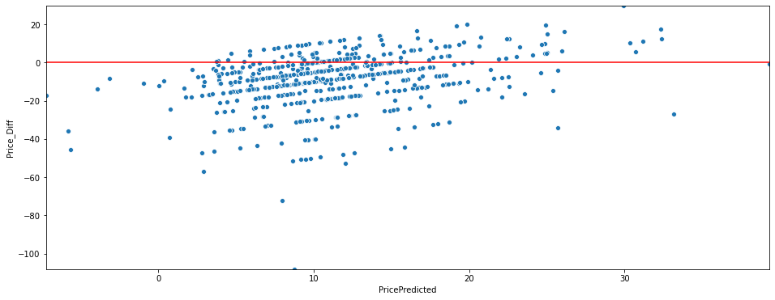


Nothing unexpected here. Terrible accuracy and no good scores for Mean Squared Error or r-squared scores. So, Price and Genre tags aren't able to really be predicted with this dataset.

Let's take a look at the correlations that can be found, when basing the data off of specific values in differing columns. As an example, let's drill down on developers to begin with. First we'll make a list of developers, then iterate through the list, picking out each developers data. Let's see if we can come up with any commonalities that games have, based on the developer!


```python
dev_brk = gms2.copy()
dev_top30 = dev_brk['Developer_Primary'].value_counts().nlargest(30).rename_axis('Developer_Primary').reset_index(name='Title_Count')
```


```python
# dev_uniques.rename(columns={0: 'DevNm'}, inplace=True)
dev_top30.info()
```

    <class 'pandas.core.frame.DataFrame'>
    RangeIndex: 30 entries, 0 to 29
    Data columns (total 2 columns):
     #   Column             Non-Null Count  Dtype 
    ---  ------             --------------  ----- 
     0   Developer_Primary  30 non-null     object
     1   Title_Count        30 non-null     int64 
    dtypes: int64(1), object(1)
    memory usage: 608.0+ bytes
    


```python
dev_brk = dev_brk
# dev_brk = dev_brk.drop(['Purchase_Options',
#                         'Franchise_Count',  
#                         'Developer_Count', 
#                         'Publisher_Count']
#                         , axis=1)

for devo in dev_top30['Developer_Primary']:
    dtmp = dev_brk.loc[dev_brk['Developer_Primary'] == devo]
    # https://stackoverflow.com/questions/17778394/list-highest-correlation-pairs-from-a-large-correlation-matrix-in-pandas
    corr_matrix = dtmp.corr().abs()
    # numpy.triu function returns the upper triangle of a matrix. It requires parameters which
    # tell it the number of rows, and whether you want the rows above or below the diagonal
    # center line of the matrix. np.ones is used to create an array of 1's, using the shape of
    # the resulting corr_matrix created above.
    sol = (corr_matrix.where(np.triu(np.ones(corr_matrix.shape), k=1).astype(np.bool))
                     .stack()
                     .sort_values(ascending=False))
    print('---------------------------')
    print('DEVELOPER',devo,sep=' --> ')
    print('---------------------------')
    print(sol)
```

    ---------------------------
    DEVELOPER --> Choice of Games
    ---------------------------
    Franchise_Count  Purchase_Options    0.984732
                     Price               0.859472
    Price            Purchase_Options    0.083616
    dtype: float64
    ---------------------------
    DEVELOPER --> Blender Games
    ---------------------------
    Total_Rev        Purchase_Options    1.000000
    PCT_Pos_Rev      Purchase_Options    1.000000
                     Total_Rev           1.000000
    Franchise_Count  Price               0.705525
    Price            Purchase_Options    0.045038
    Franchise_Count  Purchase_Options    0.011016
    dtype: float64
    ---------------------------
    DEVELOPER --> Laush Dmitriy Sergeevich
    ---------------------------
    Franchise_Count  Purchase_Options    0.289642
                     Price               0.036205
    Price            Purchase_Options    0.007811
    dtype: float64
    ---------------------------
    DEVELOPER --> Ripknot Systems
    ---------------------------
    Franchise_Count  Price    1.570092e-16
    dtype: float64
    ---------------------------
    DEVELOPER --> Nikita "Ghost_RUS"
    ---------------------------
    Price            Purchase_Options    0.309219
    Franchise_Count  Price               0.250000
    Developer_Count  Purchase_Options    0.166667
    Franchise_Count  Purchase_Options    0.158114
    Developer_Count  Price               0.056842
    dtype: float64
    ---------------------------
    DEVELOPER --> ????
    ---------------------------
    Total_Rev        Franchise_Count     1.000000
    PCT_Pos_Rev      Franchise_Count     1.000000
    Developer_Count  Publisher_Count     0.807764
    Total_Rev        Purchase_Options    0.655254
    Developer_Count  Franchise_Count     0.390965
    Franchise_Count  Price               0.355274
    PCT_Pos_Rev      Price               0.210389
                     Purchase_Options    0.173205
    Total_Rev        Price               0.162406
    Franchise_Count  Purchase_Options    0.148361
    Developer_Count  Purchase_Options    0.122312
    Publisher_Count  Purchase_Options    0.098799
    Price            Purchase_Options    0.081865
    Publisher_Count  Price               0.069673
    PCT_Pos_Rev      Total_Rev           0.067896
    Developer_Count  Price               0.030163
    dtype: float64
    ---------------------------
    DEVELOPER --> Sokpop Collective
    ---------------------------
    PCT_Pos_Rev  Price        0.162776
                 Total_Rev    0.021651
    Total_Rev    Price        0.012002
    dtype: float64
    ---------------------------
    DEVELOPER --> Square Enix
    ---------------------------
    Franchise_Count  Price               0.564099
    Developer_Count  Franchise_Count     0.530454
    PCT_Pos_Rev      Price               0.498407
    Total_Rev        Purchase_Options    0.333472
    PCT_Pos_Rev      Total_Rev           0.262097
    Developer_Count  Purchase_Options    0.243072
    Franchise_Count  Purchase_Options    0.210279
    Developer_Count  Price               0.189556
    PCT_Pos_Rev      Purchase_Options    0.160019
    Total_Rev        Developer_Count     0.140936
                     Price               0.131420
                     Franchise_Count     0.106967
    Price            Purchase_Options    0.087732
    PCT_Pos_Rev      Developer_Count     0.009718
                     Franchise_Count     0.003511
    dtype: float64
    ---------------------------
    DEVELOPER --> Hosted Games
    ---------------------------
    Price  Purchase_Options    0.108532
    dtype: float64
    ---------------------------
    DEVELOPER --> KOEI TECMO GAMES CO.
    ---------------------------
    Franchise_Count  Purchase_Options    1.000000
    PCT_Pos_Rev      Purchase_Options    0.763231
                     Total_Rev           0.344297
    Price            Purchase_Options    0.312504
    PCT_Pos_Rev      Price               0.215440
    Total_Rev        Price               0.173114
                     Purchase_Options    0.122738
    dtype: float64
    ---------------------------
    DEVELOPER --> Creobit
    ---------------------------
    Developer_Count  Price               0.880567
    Price            Purchase_Options    0.254495
    Developer_Count  Purchase_Options    0.067884
    dtype: float64
    ---------------------------
    DEVELOPER --> Humongous Entertainment
    ---------------------------
    Publisher_Count  Purchase_Options    0.751671
                     Price               0.078811
    Price            Purchase_Options    0.068082
    dtype: float64
    ---------------------------
    DEVELOPER --> Eipix Entertainment
    ---------------------------
    Developer_Count  Franchise_Count    2.119496e-01
                     Price              6.092854e-16
    Franchise_Count  Price              2.951720e-16
    dtype: float64
    ---------------------------
    DEVELOPER --> Warfare Studios
    ---------------------------
    Franchise_Count  Price               0.279680
                     Purchase_Options    0.182504
    Price            Purchase_Options    0.159132
    dtype: float64
    ---------------------------
    DEVELOPER --> HeR Interactive
    ---------------------------
    Total_Rev    Price               0.990270
                 Purchase_Options    0.990270
    PCT_Pos_Rev  Total_Rev           0.919517
                 Price               0.860696
                 Purchase_Options    0.860696
    Price        Purchase_Options    0.005216
    dtype: float64
    ---------------------------
    DEVELOPER --> HexWar Games
    ---------------------------
    Series([], dtype: float64)
    ---------------------------
    DEVELOPER --> Arc System Works
    ---------------------------
    Franchise_Count  Purchase_Options    1.000000
                     Price               1.000000
    Developer_Count  Franchise_Count     1.000000
    Total_Rev        Price               0.830537
    Price            Purchase_Options    0.654327
    PCT_Pos_Rev      Developer_Count     0.537702
    Total_Rev        Purchase_Options    0.498345
    PCT_Pos_Rev      Price               0.432087
                     Purchase_Options    0.292897
                     Total_Rev           0.243200
    Total_Rev        Developer_Count     0.214187
    Developer_Count  Price               0.213114
                     Purchase_Options    0.099844
    dtype: float64
    ---------------------------
    DEVELOPER --> ERS G Studios
    ---------------------------
    Franchise_Count  Price    0.16557
    dtype: float64
    ---------------------------
    DEVELOPER --> Winged Cloud
    ---------------------------
    Total_Rev    Purchase_Options    0.937971
                 Price               0.719513
    Price        Purchase_Options    0.559618
    PCT_Pos_Rev  Price               0.475708
                 Total_Rev           0.090172
                 Purchase_Options    0.019811
    dtype: float64
    ---------------------------
    DEVELOPER --> Ubisoft Montreal
    ---------------------------
    Developer_Count  Franchise_Count     0.774597
    Price            Purchase_Options    0.601757
    Developer_Count  Purchase_Options    0.551135
                     Price               0.510769
    PCT_Pos_Rev      Franchise_Count     0.437106
    Total_Rev        Purchase_Options    0.434313
                     Franchise_Count     0.324286
    Franchise_Count  Purchase_Options    0.304593
                     Price               0.215658
    PCT_Pos_Rev      Total_Rev           0.201287
                     Developer_Count     0.140971
                     Price               0.130181
    Total_Rev        Price               0.092204
    PCT_Pos_Rev      Purchase_Options    0.022935
    Total_Rev        Developer_Count     0.005755
    dtype: float64
    ---------------------------
    DEVELOPER --> ?????
    ---------------------------
    Developer_Count  Publisher_Count     1.000000
    Franchise_Count  Price               0.944911
    Publisher_Count  Purchase_Options    0.589768
    Developer_Count  Purchase_Options    0.589768
    Publisher_Count  Franchise_Count     0.500000
    Developer_Count  Franchise_Count     0.500000
    Franchise_Count  Purchase_Options    0.500000
    Total_Rev        Price               0.347860
                     Purchase_Options    0.175484
    PCT_Pos_Rev      Developer_Count     0.168121
                     Publisher_Count     0.168121
                     Purchase_Options    0.161934
    Total_Rev        Publisher_Count     0.141921
                     Developer_Count     0.141921
    PCT_Pos_Rev      Total_Rev           0.117464
    Developer_Count  Price               0.115196
    Publisher_Count  Price               0.115196
    PCT_Pos_Rev      Price               0.105201
    Price            Purchase_Options    0.076946
    dtype: float64
    ---------------------------
    DEVELOPER --> Elephant Games
    ---------------------------
    Franchise_Count  Price    0.265602
    dtype: float64
    ---------------------------
    DEVELOPER --> Somer Games
    ---------------------------
    Price  Purchase_Options    3.703960e-16
    dtype: float64
    ---------------------------
    DEVELOPER --> Milestone S.r.l.
    ---------------------------
    PCT_Pos_Rev      Franchise_Count     1.000000
    Franchise_Count  Purchase_Options    1.000000
    Publisher_Count  Franchise_Count     1.000000
    Franchise_Count  Price               0.866025
    PCT_Pos_Rev      Publisher_Count     0.576865
                     Price               0.523037
    Publisher_Count  Price               0.441178
    PCT_Pos_Rev      Total_Rev           0.243982
    Total_Rev        Purchase_Options    0.205789
    Publisher_Count  Purchase_Options    0.156293
    Total_Rev        Franchise_Count     0.137253
    Price            Purchase_Options    0.117534
    Total_Rev        Price               0.084533
                     Publisher_Count     0.070788
    PCT_Pos_Rev      Purchase_Options    0.014765
    dtype: float64
    ---------------------------
    DEVELOPER --> Frontwing
    ---------------------------
    PCT_Pos_Rev      Total_Rev           1.000000
    Developer_Count  Purchase_Options    0.265908
    Price            Purchase_Options    0.195658
    Developer_Count  Price               0.054814
    dtype: float64
    ---------------------------
    DEVELOPER --> MicroProse Software
    ---------------------------
    Total_Rev        Price               1.000000
                     Publisher_Count     1.000000
    PCT_Pos_Rev      Price               1.000000
                     Publisher_Count     1.000000
                     Total_Rev           1.000000
    Publisher_Count  Price               1.000000
    Price            Purchase_Options    0.605598
    Publisher_Count  Purchase_Options    0.605598
    Developer_Count  Purchase_Options    0.335083
                     Publisher_Count     0.011358
                     Price               0.011358
    dtype: float64
    ---------------------------
    DEVELOPER --> RewindApp
    ---------------------------
    PCT_Pos_Rev  Total_Rev    0.991991
    dtype: float64
    ---------------------------
    DEVELOPER --> Jetdogs Studios
    ---------------------------
    Publisher_Count  Price               0.524803
    Developer_Count  Publisher_Count     0.322329
                     Purchase_Options    0.322329
    Price            Purchase_Options    0.216957
    Publisher_Count  Purchase_Options    0.045455
    Developer_Count  Price               0.015593
    dtype: float64
    ---------------------------
    DEVELOPER --> Anamik Majumdar
    ---------------------------
    Series([], dtype: float64)
    ---------------------------
    DEVELOPER --> Valve
    ---------------------------
    Total_Rev        Developer_Count     0.951534
                     Price               0.535085
    PCT_Pos_Rev      Price               0.506014
    Developer_Count  Price               0.394698
    PCT_Pos_Rev      Purchase_Options    0.378639
    Total_Rev        Purchase_Options    0.310693
    Price            Purchase_Options    0.297417
    Developer_Count  Purchase_Options    0.186871
    PCT_Pos_Rev      Total_Rev           0.113920
                     Developer_Count     0.105000
    dtype: float64
    


```python
dev_cog = dev_brk.loc[dev_brk['Developer_Primary'] == 'Choice of Games']
dev_cog.mean()
```


    PCT_Pos_Rev           96.000000
    Total_Rev           1748.000000
    Developer_Count        1.000000
    Publisher_Count        1.000000
    ESRB                        NaN
    ESRBWhy                     NaN
    Franchise_Count        3.400000
    Price                  4.916606
    Purchase_Options       1.100917
    dtype: float64


As you can see, again, nothing is providing a correlation that wouldn't be something obvious. The idea that we have the Price column correlating with the review columns, really tells us nothing. It's pretty obvious that a game's price would correlate with reviews. The various counts on developer and publisher, along with the Franchise and purchase options, were taken out of the dataset entirely. There was a tendency to have the price or reviews correlate with these options. However,  those correlations really didn't tell us anything that wouldn't be obvious. All of these have count values, and are repeated for many of the games. You can see this in the results from the mean() function above, where we filtered on Choice of Games as the developer. This indicates that, nearly, all of the purchase options are 1.

At this point, it would seem that the only correlation we've been able to see, is with the ESRBWhy tags and their ESRB ratings. Which is a useless observation. Even after gathering 16,000 game titles from Steam, we cannot easily predict what the price should be for a game, nor what the reviews will be.


```python

```


```python

```


```python

```


```python

```


```python

```


```python

```


```python

```


```python

```


```python

```


```python

```


```python

```
